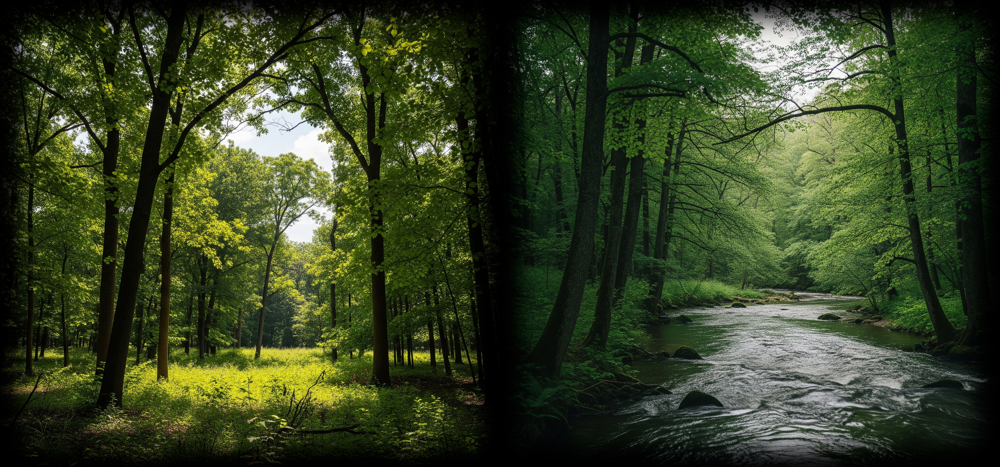
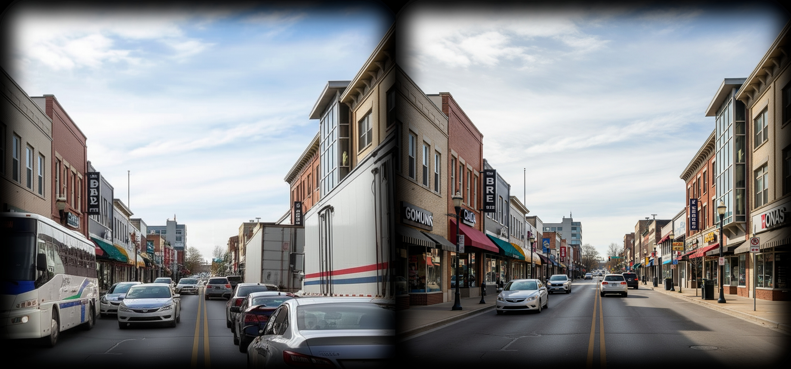
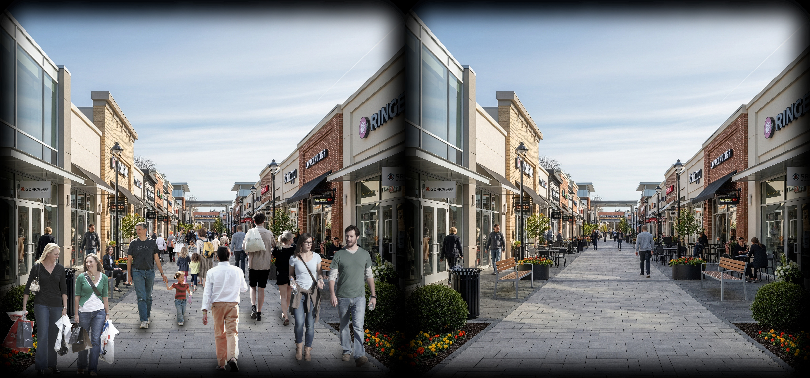
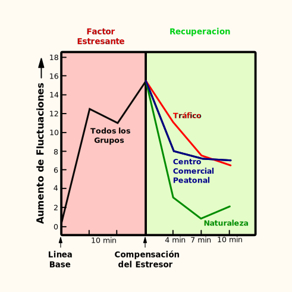
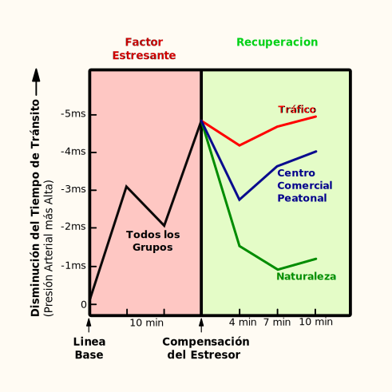
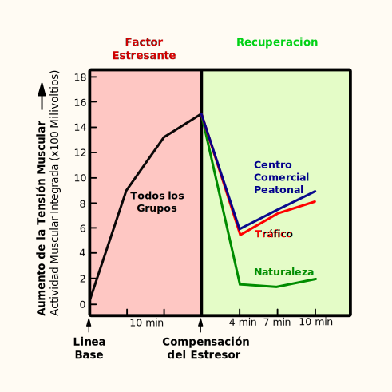
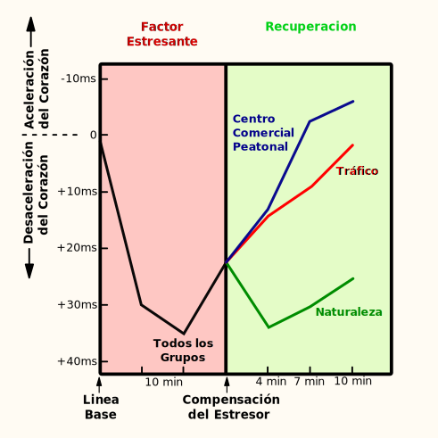
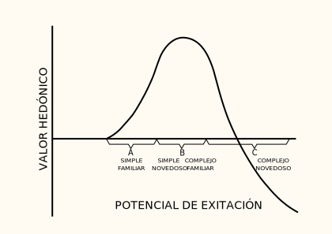
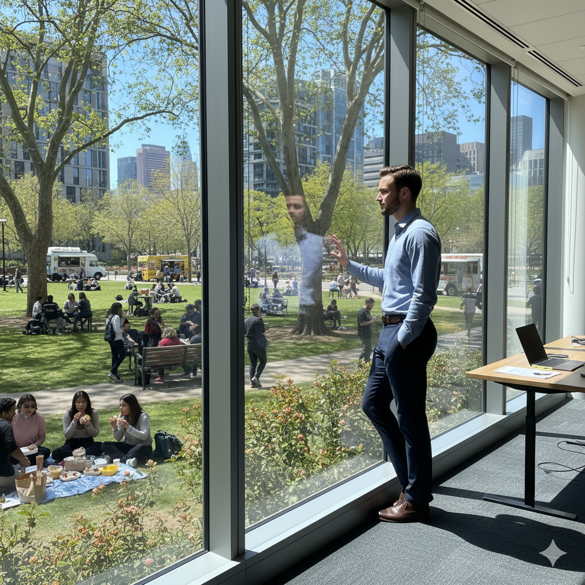

## Una exploración de la teoría de recuperación del estrés durante la exposición a entornos naturales y urbanos de Roger Ulrich y su perspectiva psicoevolutiva

### ¿Cómo los espacios que frecuentamos afectan nuestros procesos cognitivos y el bienestar psicológico?

Los entornos cotidianos mas comunes hoy en día, para la mayoría de los seres humanos, tienen características urbanas. Según el Banco Mundial y la Organización Mundial de la Salud, el 56% de la población mundial vive en ciudades (1) y se provee que esta cifra aumente al 68% para el 2050 (2). Estos datos hablan sobre la transformación que ha estado sufriendo los entornos que frecuentamos, alejándonos progresivamente de ámbitos naturales, en los que evolucionamos como especie a lo largo del tiempo.

El desplazamiento hacia las urbes ha provocado que las personas se vean inmersas en un constante bombardeo de estímulos estresantes como la alta densidad de población, la contaminación acústica y del aire, el tráfico y un ritmo de vida acelerado. Los factores ambientales, como el hacinamiento, el ruido en la comunidad o la contaminación atmosférica pueden provocar un estrés considerable en grandes grupos de personas.

El estrés es el proceso mediante el cual una persona responde psicológica, fisiológica y, a menudo, con comportamientos, a una situación que desafía o amenaza su bienestar. 
- El componente psicológico incluye la evaluación cognitiva de la situación, emociones como el miedo, la ira y la tristeza, y las respuestas de afrontamiento. 
- El aspecto fisiológico consiste en respuestas de actividad en numerosos sistemas corporales, como el cardiovascular, el esquelético-muscular y el neuroendocrino, que movilizan a la persona para afrontar o manejar la situación. Esta movilización consume recursos o energía y, si se prolonga, contribuye a la **fatiga**. 
- El componente conductual incluye una amplia gama de manifestaciones, como la evitación, el consumo de alcohol o cigarrillos, y la disminución del rendimiento cognitivo en tareas como la corrección de textos. Además, tras el cese de un factor estresante, pueden observarse secuelas como una disminución de la tolerancia a la frustración y un menor rendimiento en las tareas.

Dado que las respuestas a factores estresantes y fatigantes, tanto a corto como a largo plazo, a veces implican **disminuciones en el funcionamiento cognitivo o el rendimiento, la recuperación puede evidenciarse en mejoras en el rendimiento**.
La recuperación del estrés implica numerosos cambios positivos en los estados psicológicos, en los niveles de actividad de los sistemas fisiológicos y, a menudo, en el comportamiento o el funcionamiento, incluyendo el funcionamiento o el rendimiento cognitivo. Ademas de cambios positivos en los estados emocionales, es decir, la reducción de los niveles de sentimientos negativos, como el miedo o la ira, y el aumento de los afectos positivos.

### Teoría de Recuperación del Estrés (SRT): ¿Nuestros escenarios habituales pueden tener efectos restauradores, mientras que otros, dificultan la recuperación?

Diferentes entornos físicos cotidianos, no extremos o inusuales, como el estrés térmico o el ruido intenso de los aviones, tienen diversas influencias en cuanto a favorecer o dificultar la recuperación del estrés. 
**Roger S. Ulrich, profesor de arquitectura e investigador en diseño sanitario (3), en su Teoria de Recuperación del Estrés** (Stress Recovery Theory - SRT)(4), investigo hasta qué punto la exposición a diferentes entornos cotidianos al aire libre puede favorecer o dificultar la recuperación del estrés, mediante una combinación multimodal de medidas fisiológicas y verbales. Su intención era comprobar la idea de que la **exposición a entornos naturales puede promover una mayor recuperación del estrés que el contacto con entornos urbanos**, tanto en los estados emocionales y como en los indicadores fisiológicos. Las hipótesis sobre los aspectos emocionales, atencionales y fisiológicos de las influencias de la naturaleza en la reducción del estrés se derivan de una [Teoria Psicoevolutiva](#teoria-psicoevolutiva)

#### Evaluación Experimental

Para investigar estas hipótesis, 120 sujetos vieron primero una película estresante en blanco y negro, sobre la prevención de accidentes laborales que muestra varias lesiones graves, con sangre simulada y mutilaciones, que sufren los empleados de un taller de carpintería como resultado de su descuido o incumplimiento de las medidas de seguridad. 

Tras el factor estresante, los participantes fueron separados en seis grupos de veinte y cada grupo visualizo una cinta de video, de diez minutos a color y con sonido, de uno de seis entornos naturales y urbanos diferentes. 
Los datos sobre la recuperación del estrés durante las presentaciones ambientales se obtuvieron a partir de autoevaluaciones de estados afectivos y una serie de medidas fisiológicas: período cardíaco, tensión muscular, conductancia cutánea y tiempo de tránsito del pulso, una medida no invasiva que se correlaciona con la presión arterial sistólica. 

##### Entornos Naturales

Dos de los entornos estaban dominado por árboles y otra vegetación, uno de ellos contenía un arrollo de agua.

##### Entornos Urbanos con Trafico Vehicular

Dos de los cuatro entornos urbanos, consistían en una calle comercial con trafico vehicular en ambos sentidos, variando en la cantidad y velocidad del trafico.

##### Entornos Urbanos con Peatones

Los otros dos entornos urbanos constaban de un centro comercial al aire libre, peatonal, circulación bidireccional y sin tráfico, uno con gran afluencia de público y otro con menos gente

#### Resultados Obtenidos

Los resultados obtenidos de las medidas fisiológicas y verbales indicaron que, tras un factor estresante, la recuperación fue más rápida y completa cuando los sujetos estuvieron expuestos a entornos naturales que a urbanos, evidenciándose en un cambio hacia un estado emocional más positivo, mediante la **disminución de la activación fisiológica**, acompañados de **niveles de atención comparativamente altos**.

FIGURA 1. Cambios en la conductancia de la piel durante el estrés y la recuperación
	La Respuesta de la Conductancia Cutanea (RCC) aumenta durante el estrés y disminuyen durante la recuperación

FIGURA 2. Cambios en el Tiempo de Tránsito del Pulso (TTP) durante el estrés y la recuperación.
	El TTP disminuye durante el estrés y aumenta durante la recuperación

FIGURA 3. Cambios en la Tensión Muscular (TM) durante el estrés y la recuperación.
	La TM aumenta durante el estrés y disminuyen durante la recuperación

FIGURA 4. 
Cambios en el Período Cardíaco (PC) durante el estrés y la recuperación
	Tanto los estímulos ambientales desagradables como los agradables, si provocan captación o atención, provocan desaceleración cardíaca, por lo tanto, la respuesta de desaceleración de la frecuencia cardíaca durante el factor estresante, se debe a que los estímulos de sangre y mutilación son potentes para provocar atención/captación.

**La RCC (Fig. 1), el TTP (Fig. 2) y la EMG (Fig. 3) sirvieron como medidas de estrés, mientras que la PC (Fig. 4) se consideró un indicador de ingesta/atención.** 

El patrón de hallazgos fisiológicos, además de sugerir que la naturaleza provocó una mayor ingesta/atención, planteó la posibilidad de que las respuestas a la naturaleza tuvieran un componente destacado del sistema nervioso parasimpático; que no se observó en las respuestas a los entornos urbanos, dado que, las **influencias parasimpáticas desempeñan un papel central en la atención y la recuperación**, a diferencia de la activación simpática, fundamental en la exigente movilización que implica la respuesta a los factores estresantes.
Además, los resultados de las autoevaluaciones ZIPERS sugirieron que los entornos naturales tenían influencias restauradoras más fuertes que los entornos urbanos, en tres dimensiones afectivas: afectos positivos, ira/agresión y miedo. 

| factor ZIPERS     | Naturaleza | Centro Comercial Peatonal | Trafico | F     | P      |
| ----------------- | ---------- | ------------------------- | ------- | ----- | ------ |
| Miedo             | -1.46      | -1.00                     | -0.77   | 4.36  | 0.01   |
| Ira/Agresión   | -1.95      | +0.18                     | -0.82   | 9.97  | <0.001 |
| Afectos positivos | +5.52      | +1.18                     | -0.08   | 26.33 | <0.001 |
| Tristeza          | -1.51      | -1.26                     | -1.25   | 0.55  | NS     |
| Atención/Interés  | -1.02      | -1.64                     | -1.02   | 1.35  | NS     |

TABLA 1. Cambios en la puntuación de factores, antes y después de la recuperación

**Influencias de los entornos en los estados afectivos**
### ¿Disminuir el estrés puede aumentar nuestras sensaciones placenteras?
La teoría de la activación predice que el aumento de **afectos positivos producido por la naturaleza están asociados a la reducción en los indicadores de activación fisiológica**. Como Berlyne (5) y otros han postulado, una disminución de la activación produce un aumento de las sensaciones placenteras si el estado inicial de un individuo es estrés o activación excesiva.

*" Un estímulo con alta novedad y complejidad tendrá un alto valor de excitación y, por lo tanto, corresponderá a un punto en el eje horizontal de la Región C. Al perder su novedad, el punto que representa su potencial de excitación se desplazaría hacia la Región B, acompañado de un aumento en el valor hedónico"* 

En relación con este tema, durante la recuperación del estrés, se hallo un patrón de correlaciones significativas entre las medidas autonómicas (sistema nervioso autónomo, encargado de las reacciones fisiológicas involuntarias) y cada ítem que compone el factor de afectos positivos, lo que indica que **los afectos positivos aumentaron a medida que disminuyó la activación autonómica, pero no la somática** (sistema nervioso somático, a cargo de las acciones voluntarias. Sus nervios conectan el cerebro y la médula espinal con los músculos esqueléticos y con los receptores sensitivos de la piel).

### La exposición a la naturaleza, aun en episodios cortos ¿Son suficientes para reducir el estrés en la vida urbana cotidiana?

Otro hallazgo relevante de la investigación de Ulrich fue la rapidez y eficacia de la recuperación durante las exposiciones naturales. Durante los primeros cuatro minutos de recuperación, todos los grupos experimentaron al menos cierto grado de recuperación, pero los grupos de naturaleza lograron una recuperación cercana a los niveles basales y entre los cinco y siete minutos, se observó una recuperación significativamente mayor en los grupos de naturaleza, en comparación con los sujetos expuestos a entornos urbanos, para los tres indicadores de estrés fisiológico (SCR, PTT, EMG).
La rapidez de la recuperación en las condiciones de naturaleza plantea la posibilidad de que **estos hallazgos se apliquen en muchos contextos reales caracterizados por contactos breves con la naturaleza.** 

En los países urbanizados, la gran mayoría de los encuentros con elementos de la naturaleza probablemente sean episodios cortos que duran solo unos segundos o minutos. Los tipos comunes de contacto con la naturaleza en las zonas urbanas pueden incluir, por ejemplo, observar árboles a través de una ventana en un lugar de trabajo o residencia, almorzar en un parque o conducir por una zona periférica urbana donde las cunetas de las carreteras están poco desarrolladas. 
Los hallazgos del estudio evidencian que las exposiciones breves a la naturaleza podrían desempeñar un papel importante en muchas zonas urbanas, facilitando la recuperación de factores estresantes como las molestias o los problemas cotidianos.

### Teoria Psicoevolutiva

Esta combinación de hallazgos fueron consistentes con las predicciones de la teoría psicoevolutiva de Ulrich, que afirma que las influencias restauradoras de la naturaleza implican cambios hacia un estado emocional más positivo, ademas de cambios positivos en los niveles de actividad fisiológica, acompañados de una atención/consumo sostenido. 
Los estímulos naturales implican respuestas afectivas de inicio rápido que parecen estar estrechamente relacionadas con la atención y el posterior procesamiento consciente.
Con respecto a la recuperación del estrés, una respuesta afectiva inicial positiva, compuesta por agrado e interés moderado a alto, debería motivar y mantener una atención/consumo prolongado, producir niveles más altos de sentimientos positivos, reducir los sentimientos negativos o relacionados con el estrés, como el miedo y la ira, y suprimir los pensamientos estresantes o ajenos, reduciendo la movilización fisiológica exigente y la participación del sistema nervioso parasimpático, que funcionaría para restaurar la energía. 
Las propiedades de la naturaleza para retener la atención funcionan en ambos sentidos; es decir, la atención involuntaria puede ser un componente destacado de las reacciones no restauradoras e incluso estresantes a ciertos estímulos naturales, y también puede ser un componente destacado de las respuestas restauradoras a entornos naturales no amenazantes. Si la respuesta afectiva inicial es negativa (por ejemplo, aversión, miedo) ante estímulos o configuraciones naturales como serpientes y alturas, la respuesta emocional, cognitiva y fisiológica resultante probablemente no será restauradora e incluso podría ser estresante, independientemente de si la respuesta implica atención involuntaria o fascinación.

### Referencias

1. https://www.bancomundial.org/es/topic/urbandevelopment/overview
2. https://www.who.int/health-topics/urban-health
3. https://www.healthdesign.org/about-us/meet-team/roger-s-ulrich-phd-edac
4. Ulrich, R. S., Simons, R. F., Losito, B. D., Fiorito, E., Miles, M. A., & Zelson, M. (1991). Stress recovery during exposure to natural and urban environments. _Journal of Environmental Psychology_, _11_, 201-230.
5. Berlyne, D. E. (1970). Novelty, complexity, and hedonic value. _Perception & Psychophysics_, _8_(5A), 279-286.

