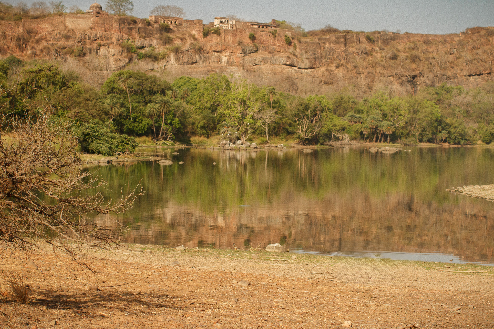

## Un estudio sobre el concepto de **biofilia** y su fundamentación evolutiva en la **Hipótesis de la Sabana**, revelando nuestra necesidad innata de conectar con el entorno natural; y cómo satisfacer estas demandas biológicas en la arquitectura moderna a través de **14 patrones de diseño biofílico**, estrategias esenciales para crear espacios que promuevan la salud y el bienestar.

# ¿Que es Biofilia?

El concepto de 'biofilia' fue introducido originalmente por el psicólogo social Erich Fromm en su libro de 1964, *The Heart of Man (El Corazon del Hombre)*. 
Fromm afirmó que la esencia de la biofilia es el amor a la vida. Esta orientación constituye una predisposición vital total, cuya forma más elemental se manifiesta en la tendencia inherente a la supervivencia de todos los organismos vivos. (1.)

*"Observamos esta tendencia a vivir en toda la materia viva que nos rodea; en la hierba que crece entre las piedras en busca de luz y de vida; en el animal que luchará hasta lo último para escapar a la muerte; en el hombre que dará casi cualquier cosa para conservar la vida"* 

Erich Fromm. El Corazón Del Hombre. Su potencia para el bien y para el mal. P. 35

Años más tarde, el biólogo Edward O. Wilson popularizó este termino, en su libro de 1984 titulado *Biophilia*, donde la definió *"como la tendencia innata a centrarse en la vida y en los procesos que la asemejan"*(2.), señalando que el cerebro humano evolucionó durante un periodo de unos dos millones de años mientras los humanos existían como cazadores y recolectores en íntimo contacto con el medio ambiente natural. 

*"Porque si los animales eligen hábitats mediante dispositivos de orientación y aprendizaje predefinidos, incorporados durante generaciones de selección natural, es posible que las personas hagan lo mismo. Si ciertos sentimientos humanos son innatos, podrían no ser fáciles de expresar en lenguaje racional. Un enfoque más prometedor es explorar la naturaleza del entorno en el que evolucionó el cerebro."* 

Edward O. Wilson. Biophilia. P. 109

Wilson encuentra apoyo para esta idea en los trabajos de Gordon Orians y Judith Heerwagen en Savanna Hypothesis: *"La Hipótesis de la Sabana afirma que **conservamos preferencias genéticas por las características de las sabanas africanas de alta calidad** donde vivieron nuestros antepasados ​​cuando sus cerebros y cuerpos evolucionaron hacia sus formas modernas."* (3.) 

En su libro, cita a Orians como uno de los científicos que sugirieron que la mente está "predispuesta a la vida en la sabana":

*"Orians, en particular, ha elaborado la idea según la teoría evolutiva moderna y ha añadido un pequeño pero sugerente conjunto de pruebas que la respaldan. Según su formulación, el entorno ancestral contenía tres características clave. En primer lugar, la sabana, por sí sola, sin ningún otro añadido, ofrecía una abundancia de alimentos animales y vegetales a los que los homínidos omnívoros estaban bien adaptados, así como la visión clara necesaria para detectar animales y bandas rivales a largas distancias. En segundo lugar, era deseable un cierto relieve topográfico. Acantilados, montículos y crestas eran los puntos estratégicos desde los que se podía realizar una vigilancia aún más lejana, mientras que sus salientes y cuevas servían como refugios naturales por la noche. Durante las marchas más largas, los grupos dispersos de árboles proporcionaban refugios auxiliares que albergaban cuerpos de agua potable. Por último, los lagos y ríos ofrecían peces, moluscos y nuevos tipos de plantas comestibles. Dado que pocos enemigos naturales del hombre pueden cruzar aguas profundas, las costas se convirtieron en perímetros naturales de defensa."*

Edward O. Wilson. Biophilia. P. 110

La teoría evolutiva subyacente a la hipótesis de Orians y Heerwagen, revela la influencia que tiene el habitat sobre nuestras emociones, sugiriendo que la atracción por paisajes con características de sabana (vistas despejadas, refugios y agua) no es una elección aprendida, sino una preferencia biológica grabada por la evolución.

*"La teoría evolutiva sugiere que la capacidad de un paisaje para evocar estados emocionales positivos debería estar correlacionada positivamente con la supervivencia y el éxito reproductivo esperados de los individuos de esa especie en él. En otras palabras, los buenos hábitats deberían evocar respuestas positivas fuertes; los hábitats deficientes deberían evocar respuestas débiles o negativas."*

Gordon H. Orians. Savanna Hypothesis

Este concepto, aplicado a la realidad humana moderna, evidencia la necesidad de retomar nuestras necesidades biológicas profundas. En relación con este desajuste temporal entre nuestra evolución y nuestro hábitat actual, los autores advierten que:

*"Hemos vivido en entornos mecanizados y urbanos durante relativamente pocas generaciones. A menos que haya habido una fuerte contraselección en su contra, no ha transcurrido suficiente tiempo para que nuestros patrones de respuesta evolutivos a los paisajes se hayan modificado sustancialmente en los entornos radicalmente nuevos y diferentes en los que vivimos hoy. Las respuestas emocionales iniciales de las personas a un entorno desconocido son casi instantáneas y no cognitivas."*

Gordon H. Orians. Savanna Hypothesis

# Biofilia Aplicada a la Arquitectura

Partiendo de la premisa de que los humanos poseen una tendencia innata a buscar conexiones con la naturaleza, la arquitectura biofilica busca satisfacer esta necesidad, utilizando estratégicamente la luz natural, la vegetación y materiales orgánicos, entre otros recursos clave de diseño, para crear ambientes que se sientan vivos. Al integrar estos elementos en nuestros lugares de trabajo y vivienda, no solo se embellece el espacio, sino que se logra reducir el estrés y aumentar la concentración, permitiendo que las personas vivan y trabajen de manera más saludable y productiva.
Terrapin Bright Green, una firma de consultoría ambiental comprometida con el mejoramiento del entorno humano, establece una serie de estrategias de diseño para la implementación biofílica, estructurados a través de catorce patrones, que se agrupan en tres categorías principales: Naturaleza en el Espacio, Analogías Naturales y Naturaleza del Espacio. (4.)

## Naturaleza en el Espacio
La primera categoría consiste en la inclusión directa de elementos naturales como plantas, agua, animales, luz dinámica y variaciones de temperatura y ventilación, para establecer conexiones multisensoriales equivalentes a las experimentadas al aire libre.

### Patrones incluidos en Naturaleza en el Espacio

**1. Conexión visual con la naturaleza**
Un vistazo a elementos de la naturaleza, sistemas vivos y procesos naturales.

**2. Conexión no visual con la naturaleza**
Estímulos auditivos, táctiles, olfatorios o gustativos que generan una referencia deliberada y positiva a la naturaleza, sistemas vivos o procesos naturales.

**3. Estímulos sensoriales no rítmicos**
Las conexiones aleatorias y efímeras con la naturaleza pueden ser analizadas estadísticamente pero no pueden ser pronosticadas con precisión.

**4. Variaciones térmicas y de corrientes de aire**
Cambios sutiles en la temperatura del aire, humedad relativa, una corriente de aire que se percibe en la piel y temperaturas superficiales que imitan entornos naturales.

**5. Presencia de agua** 
Una condición que mejora cómo experimentamos un lugar al ver, oír o tocar agua.

**6. Luz dinámica o difusa**
Aprovecha la variación de la intensidad de la luz y la sombra que cambia con el tiempo y recrea condiciones que suceden en la naturaleza.

**7. Conexión con sistemas naturales**
Conciencia de los procesos naturales, especialmente los estacionales y los temporales que son característicos de un ecosistema saludable.

## Analogías Naturales

La segunda categoría se enfoca en la incorporación indirecta de la naturaleza a través de elementos no vivos u orgánicos. Se manifiesta a traves de formas, colores, patrones y materiales que imitan la geometría y textura que se encuentran en el mundo natural.

### Patrones incluidos en Analogías Naturales

**8. Formas y patrones biomórficos**
Referencias simbólicas de contornos, patrones, texturas o sistemas numéricos presentes en la naturaleza.

**9. Conexión de los materiales con la naturaleza** 
Materiales y elementos de la naturaleza que, con un procesamiento mínimo, reflejan la ecología y geología local y crean un sentido distintivo de lugar.

**10. Complejidad y orden**
Rica información sensorial que responde a una jerarquía espacial similar a la de la naturaleza.

## Naturaleza del Espacio

Finalmente, la tercera categoría busca activar respuestas psicológicas profundamente arraigadas mediante la disposición espacial. Su propósito es satisfacer nuestra necesidad evolutiva de explorar y de ver más allá del entorno inmediato, y la innata atracción por lo levemente desconocido o peligroso, las vistas parcialmente ocultas, y los momentos de revelación. Esto se materializa a través de la provisión de amplias vistas panorámicas, la inclusión de refugios y áreas protegidas y la cuidadosa creación de intriga visual.

### Patrones incluidos en Naturaleza del Espacio

**11. Panorama**
Una vista abierta a la distancia para vigilancia y planificación.

**12. Refugio**
Un lugar para retirarse de las condiciones del entorno o del flujo diario de actividades donde la persona encuentra protección para su espalda y sobre su cabeza.

**13. Misterio**
La promesa de más información. Se logra mediante vistas parcialmente obscurecidas u otros dispositivos sensoriales para atraer a la persona a sumergirse más profundamente en el entorno.

**14. Riesgo/Peligro**
Una amenaza identificable aunada a un resguardo confiable, como una altura o una inestabilidad, pero con medidas de seguridad confiables y verificables. 

**Mediante la implementación consciente de estos catorce patrones, el diseño busca consistentemente optimizar el desempeño humano, reducir el estrés y potenciar la salud y el bienestar en el entorno construido.**

Referencias:
1. Erich Fromm. (1964). El Corazón del Hombre. Su potencia para el bien y para el mal. COLECCIÓN POPULAR FONDO DE CULTURA ECONÓMICA MÉXICO. Título original: The Heart of Man ®1964 Harper & Row, Nueva York Traducción de Florentino M. Torner D.R. l966 Fondo de Cultura Economica, S. A. de C. V. Av. de la Universidad 975; 03100 México, D. F.
2. Edward O. Wilson. (1984). Biophilia. Harvard University Press Cambridge, Massachusetts, and London, England. P. 1 
3. Gordon H. Orians. (2016). Savanna Hypothesis. University of Washington, Seattle, WA, USA. Springer International Publishing Switzerland 2016. T.K. Shackelford, V.A. Weekes-Shackelford (eds.), Encyclopedia of Evolutionary Psychological Science, DOI 10.1007/978-3-319-16999-6_2930-1
4. Browning, W.D., Ryan, C.O., Clancy, J.O. (2017). 14. Patterns of Biophilic Design [14 Patrones de diseño biofílico] (Liana Penabad-Camacho, trad.) New York: Terrapin Bright Green, LLC (Trabajo original publicado en 2014).