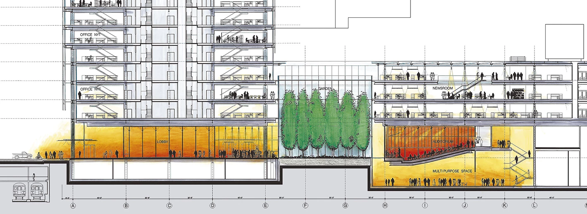
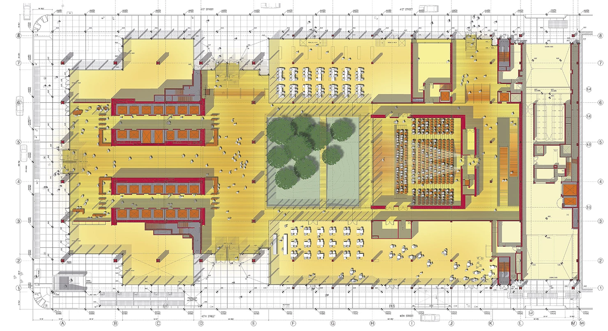
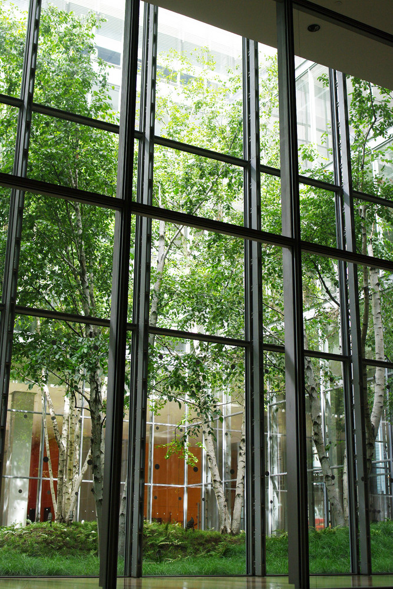
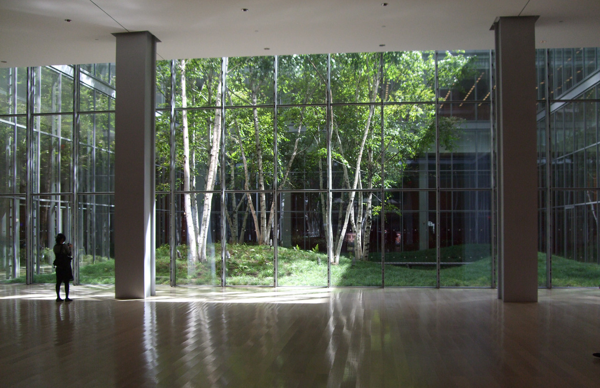
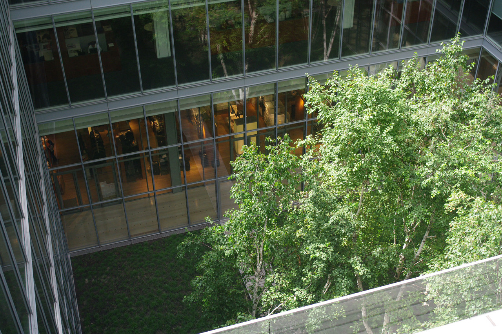
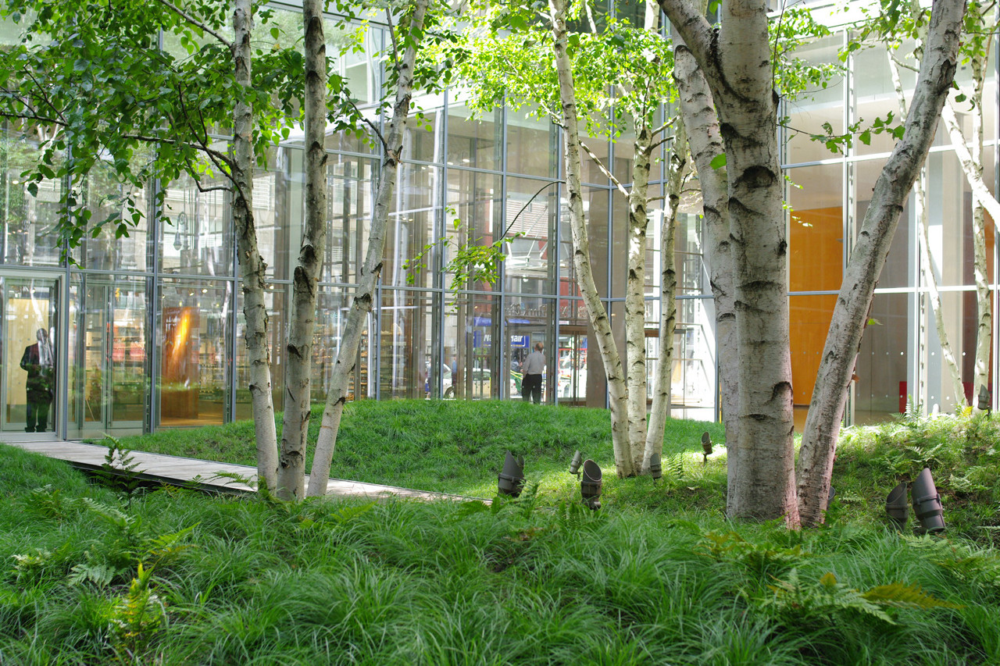
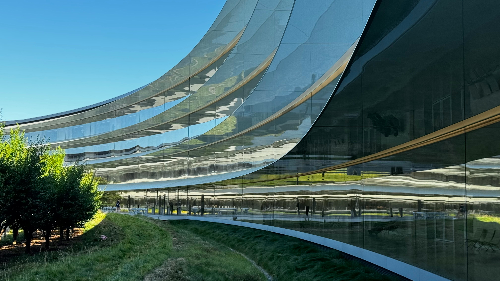

*"... el disfrute del paisaje ocupa la mente sin fatigarla, ejercitándola, tranquilizándola y vivificándola; y así, mediante la influencia de la mente sobre el cuerpo, proporciona un descanso refrescante y revitaliza todo el organismo."*  (5.)

Frederick Law Olmsted. Yosemite and the Mariposa Grove: A Preliminary Report.

Observar la naturaleza desde los espacios que frecuentamos, impacta positivamente en nuestra salud, bienestar y calidad de vida. Esta experiencia va más allá de colocar plantas en una habitación; requiere diseñar vínculos visuales con elementos y procesos naturales. Un espacio que incorpora bien este patrón se siente completo, atractivo y puede ser tanto estimulante como calmado, transmitiendo una noción de temporalidad, clima y otras formas de vida circundante. 

Un espacio saludable debe conectar al usuario con paisajes diversos, fenómenos atmosféricos y sistemas vivos, permitiéndole ser testigo del movimiento, los ciclos biológicos y la dinámica natural del entorno, como puede ser el movimiento de las hojas con el viento, el flujo del agua, el paso de las nubes, la presencia de animales o el ciclo de vida de las plantas. 

Esta conexión pertenece a la categoría de la naturaleza en el espacio (1.) y cuenta con un respaldo empírico robusto para sus beneficios en la salud. Se sustenta en investigaciones como las de Roger Ulrich, quien en un estudio de 1984, comprobó el impacto positivo que tiene conectar visualmente con la naturaleza, en la recuperación de pacientes sometidos a cirugía de vesícula biliar (colecistectomía). (2.)

Estos pacientes a menudo experimentan una ansiedad considerable, y el confinamiento hospitalario limita su acceso a entornos exteriores casi exclusivamente a las vistas a través de las ventanas. Las vistas  al exterior pueden ser especialmente importantes para las personas con horarios fijos que pasan mucho tiempo en la misma habitación, como los pacientes quirúrgicos. Es posible que una vista desde una ventana del hospital influya en el estado emocional del paciente y, en consecuencia, afecte su recuperación.

El efecto restaurador de las vistas naturales en pacientes quirúrgicos se examinó en un hospital suburbano de Pensilvania, entre 1972 y 1981. Todas las habitaciones eran idénticas, diferenciándose esencialmente en lo que se veía a través de la ventana, las cuales daban a un pequeño grupo de árboles caducifolios o a una pared de ladrillo marrón. Las observaciones se realizaron del 1 de mayo al 20 de octubre, ya que los árboles presentan follaje durante esos meses.

*Fig. 1. Plano de la segunda planta del hospital de estudio que muestra la vista de los árboles frente a la vista de la pared desde las ventanas de los pacientes. También se recopilaron datos de los pacientes asignados a las habitaciones de la tercera planta. Se excluyó una habitación de cada planta porque se veían partes de los árboles y la pared desde las ventanas.*

Los resultados del estudio de Ulrich demostraron que los pacientes que tenían vistas a través de la ventana hacia árboles y vegetación se recuperaban más rápido, con estancias hospitalarias posoperatorias más cortas, presentaban menos comentarios negativos en las notas de las enfermeras, requerían menos dosis de analgésicos moderados y fuertes, y obtuvieron puntuaciones ligeramente más bajas en cuanto a complicaciones posquirúrgicas menores, en comparación con aquellos con vistas a una pared de ladrillos.

Este hallazgo es un pilar de la [Teoría de Recuperación del Estrés (SRT) de Ulrich]( https://antoarq.github.io/el-impacto-del-entorno-en-la-salud-mental/) (3.), que postula que la exposición a entornos naturales, incluso de forma pasiva mediante una vista, desencadena una respuesta psicofisiológica positiva que reduce el estrés y la ansiedad, permitiendo una recuperación más rápida del agotamiento cognitivo y el estrés fisiológico al promover un estado de calma y bienestar. Las investigaciones de Roger Ulrich demuestran que la exposición visual a la naturaleza reduce la presión sanguínea y el ritmo cardíaco, contribuyendo a la recuperación del estrés, a la vez que mejora la atención mental, e impacta positivamente la actitud y la felicidad general. 

Desde la perspectiva de la restauración, este diseño busca ofrecer un entorno que ayude a las personas a desviar su atención para relajar los músculos de los ojos y moderar la fatiga cognitiva. 
Este enfoque responde a los principios establecidos por Rachel y Stephen Kaplan, quienes postulan que la exposición a entornos naturales o restauradores es clave para la recuperación del agotamiento mental. Nos agotamos mentalmente porque pasar mucho tiempo enfocados en una sola tarea requiere un gran esfuerzo consciente para concentrarse y suprimir distracciones. Los Kaplan explican que la solución es sumergirnos en entornos que capturen nuestro interés de manera espontánea. La naturaleza tiene esa capacidad única de atraer nuestra atención de forma involuntaria y sin esfuerzo, ayudando a que nuestro cerebro recupere su energía. Al facilitar una conexión visual con paisajes naturales, se permite que el mecanismo de atención dirigida descanse, mitigando la irritabilidad y restaurando la efectividad cognitiva. (4.)

Las investigaciones que fundamentan la conexión visual con la naturaleza demuestran que las vistas naturales actúan como un "micro-descanso" para la mente, restaurando la atención y disminuyendo la presión arterial y la frecuencia cardíaca. En esencia, convierte la contemplación en un mecanismo de recuperación del estrés y mejora la función cognitiva. Frederick Law Olmsted, el visionario paisajista célebre por diseñar el Central Park de Nueva York, ya manifestaba en 1865 una profunda convicción sobre el valor social de los espacios naturales. En su célebre informe sobre Yosemite, Olmsted argumentaba que la contemplación de paisajes naturales ejerce una influencia regeneradora en la salud psicológica del ser humano, afirmando lo siguiente:

*"... la contemplación ocasional de paisajes naturales de carácter impresionante, sobre todo si esta contemplación se produce en conexión con el alivio de las preocupaciones cotidianas, un cambio de aires y un cambio de hábitos, favorece la salud y el vigor de los hombres, y especialmente la salud y el vigor de su intelecto, más allá de cualquier otra condición que se les pueda ofrecer, ya que no solo proporciona placer momentáneo, sino que aumenta la capacidad subsiguiente de felicidad y los medios para lograrla. La falta de recreación ocasional, donde hombres y mujeres se ven habitualmente presionados por sus negocios o preocupaciones domésticas, a menudo resulta en una clase de trastornos cuya característica es la discapacidad mental, que a veces adopta formas graves como atrofia cerebral, parálisis, monomanía o locura, pero con mayor frecuencia se manifiesta como excitabilidad mental y nerviosa, malhumor, melancolía o irascibilidad, incapacitando al sujeto para el ejercicio adecuado de sus fuerzas intelectuales y morales."* (5.)

Frederick Law Olmsted. Yosemite and the Mariposa Grove: A Preliminary Report.
 

# Jardín del vestíbulo del New York Times Building de Renzo Piano + FX Fowle Architects + HM White Site Architects + Cornelia Hahn Oberlander

El edificio del New York Times, conceptualizado y diseñado por el renombrado arquitecto italiano Renzo Piano, en colaboración con FX Fowle Architects e inaugurado en 2007, se destaca por su jardín interior de abedules y musgos, un oasis que ancla el vestíbulo principal. Si bien Piano integró este espacio en la visión arquitectónica general para enfatizar la transparencia y la conexión visual con la naturaleza, el diseño botánico y la selección específica de la flora fueron encomendados a especialistas en paisajismo: la firma HM White Site Architects, en colaboración con la paisajista Cornelia Hahn Oberlander.

Edificio del New York Times, Nueva York © Nic Lehoux (2.)

En el centro de la planta baja, visible desde la calle y desde el vestíbulo, se encuentra el jardín a cielo abierto a modo de escultura viviente.

Corte Transversal (3.)

Planta baja (4.)

La naturaleza es la protagonista central, no un elemento oculto. Por ello, se eliminaron las barreras visuales pesadas, y en su lugar, se instalaron paredes de vidrio ultra claro (bajo en hierro) alrededor del área verde. Esta transparencia permite que los empleados que cruzan el lobby, los periodistas que van al auditorio y los peatones que caminan por la calle tengan una línea de visión ininterrumpida hacia este bosque encapsulado.

(5.)

Aunque está rodeado de cristal, el techo está abierto, maximizando la iluminación natural. Esto permite, ademas, que entre lluvia, nieve y viento, creando un microclima real dentro del edificio y garantizando la apreciación de los cambios que el jardín experimenta con cada estación del año.

(6.)

En verano, el follaje verde filtra la luz solar, generando sombras dinámicas. En invierno, los abedules pierden sus hojas y la nieve cubre el musgo, ofreciendo una estética minimalista y serena. Esto conecta al observador con los ciclos naturales del tiempo, algo que se suele perder en oficinas herméticas con luz artificial constante.

(7.)

Los Abedules Papeleros (Paper Birches), se distinguen por su corteza blanca y sus hojas delicadas que tiemblan con la brisa más leve, contemplar el movimiento suave de sus hojas activa el sistema nervioso parasimpático, promoviendo la relajación inmediata (incluso si solo se mira por 30 segundos). Además de este efecto calmante, la altura de los árboles de hasta 15 metros, sirve como un elemento vertical que conecta visualmente el nivel del suelo con los pisos superiores del podio.

(8.)

Por otro lado, el suelo no es de césped manicurado, sino de una alfombra de musgo y helechos que evoca un terreno forestal salvaje y primigenio, contrastando radicalmente con el asfalto de la Avenida. En medio del caos de Manhattan y el ritmo frenético de una redacción de noticias, el jardín ofrece un punto focal estático y silencioso, un espacio de serenidad y un lugar donde la mente puede descansar. No es un sitio para caminar, es un paisaje para mirar y para sentir

 
 
(9.)

| Estrategia Arquitectónica | Función Biofílica                                                                  |
| ------------------------- | ---------------------------------------------------------------------------------- |
| Paredes de Cristal        | Permeabilidad visual; borra el límite entre interior y exterior.                   |
| Abedules (Verticalidad)   | Elevan la mirada; imitan la verticalidad de los rascacielos pero con materia viva. |
| Suelo de Musgo            | Textura suave que contrasta con el acero, hormigón y vidrio.                       |
| Cielo Abierto             | Conexión con el clima y la luz natural directa.                                    |

Esta obra demuestra que no se necesitan hectáreas de parque para lograr un efecto biofílico potente. Con una selección cuidadosa de especies y una ubicación estratégica (visible para todos), se convierte en un generador de bienestar.

# Apple Park en Cupertino, California, de Norman Foster (Foster + Partners)

El Apple Park en Cupertino, California, diseñado por Norman Foster (Foster + Partners), lleva el concepto de Conexión Visual con la Naturaleza a una escala monumental. 
El campus, concebido por Steve Jobs como un "refugio natural", se extiende sobre 70 hectáreas y alberga un edificio principal en forma de anillo (The Ring). Este diseño circular y la escala del proyecto conforman un recinto de inmersión visual en la naturaleza y colocan al paisaje como el protagonista.

Foto de [Carles Rabada](https://unsplash.com/es/@carlesrgm?utm_source=unsplash&utm_medium=referral&utm_content=creditCopyText) en [Unsplash](https://unsplash.com/es/fotos/estadio-redondo-de-hormigon-gris-FouyeA9HH5U?utm_source=unsplash&utm_medium=referral&utm_content=creditCopyText)

El edificio no está en un parque, sino que el parque está dentro y alrededor del edificio, creando un manto verde continuo.
El gigantesco patio central del anillo no es vacío; es un ecosistema vivo, diseñado por la firma de paisajismo de Laurie Olin, que incluye praderas, senderos para caminar, estanques y un huerto de albaricoques, cerezas y olivos. Se plantaron más de 9,000 árboles, muchos de ellos especies nativas y resistentes a la sequía, como los robles y árboles frutales de la región de California, restaurando el paisaje original de huertos de la zona.

Foto de [Carles Rabada](https://unsplash.com/es/@carlesrgm?utm_source=unsplash&utm_medium=referral&utm_content=creditCopyText) en [Unsplash](https://unsplash.com/es/fotos/vista-aerea-del-campus-de-apple-en-cupert-california-TXp-dYghMYQ?utm_source=unsplash&utm_medium=referral&utm_content=creditCopyText)

El edificio está revestido por los paneles de vidrio curvado más grandes del mundo. Estos no son solo ventanas, son muros de cuatro pisos de altura que se extienden a lo largo de toda la circunferencia del anillo. Los 12,000 empleados que trabajan en el edificio tienen vistas panorámicas y constantes, de 360 grados, hacia la naturaleza, sin importar en qué punto del anillo se encuentren. 

Foto de [Artem Horovenko](https://unsplash.com/es/@nsobject?utm_source=unsplash&utm_medium=referral&utm_content=creditCopyText) en [Unsplash](https://unsplash.com/es/fotos/un-edificio-curvo-con-un-fondo-de-cielo-JOGyHOXgMEo?utm_source=unsplash&utm_medium=referral&utm_content=creditCopyText)

La transparencia radical y la geometría del edificio provee diferentes perspectivas y crea diversas experiencias de conexión visual, tanto hacia la pradera interna, como al paisaje circundante. 
Las vistas hacia el Interior del patio central, con sus estanques y árboles maduros, ofrecen una sensación de refugio y calma. Es un escape visual del mundo exterior, un ecosistema cerrado que fomenta la serenidad.

Foto de [Artem Horovenko](https://unsplash.com/es/@nsobject?utm_source=unsplash&utm_medium=referral&utm_content=creditCopyText) en [Unsplash](https://unsplash.com/es/fotos/un-edificio-curvo-con-arboles-y-arbustos-frente-a-el-NWrOI6ONxWY?utm_source=unsplash&utm_medium=referral&utm_content=creditCopyText)

Las vista hacia el exterior del anillo, ofrecen la sensación de panorama o dominio, enmarcando las colinas circundantes de Cupertino y el resto del paisaje del campus.

Foto de [Carles Rabada](https://unsplash.com/es/@carlesrgm?utm_source=unsplash&utm_medium=referral&utm_content=creditCopyText) en [Unsplash](https://unsplash.com/es/fotos/vista-aerea-de-la-ciudad-durante-el-dia-0HfJkC-Udhg?utm_source=unsplash&utm_medium=referral&utm_content=creditCopyText)

La transparencia total del vidrio permite que la luz natural inunde el interior durante todo el día.
Al igual que en el NYT Building, ver cómo la luz y las sombras cambian con el movimiento del sol a través de los árboles es una forma de conexión con los sistemas naturales y la variabilidad dinámica. 
El diseño está pensado para que se pueda abrir a la ventilación natural durante gran parte del año, permitiendo que el aire (y sutiles sonidos y olores) del parque circule a través de las oficinas, potenciando la conexión visual con elementos sensoriales. 

## Comparativa: NYT Building vs. Apple Park

| Característica    | NYT Building (Renzo Piano)                                             | Apple Park (Norman Foster)                                                                    |
| ----------------- | ---------------------------------------------------------------------- | --------------------------------------------------------------------------------------------- |
| Escala del Jardín | Íntima y vertical (Patio interior de abedules).                        | Masiva y horizontal (70 hectáreas, patio central de 12 hectáreas).                            |
| Función Visual    | El jardín es un punto focal sereno en un vestíbulo abierto al público. | El parque es el entorno total de trabajo, visible desde cualquier punto de la oficina (360°). |
| Geometría         | Rectangular/Vertical; el jardín es un contraste controlado.            | Circular/Horizontal; la naturaleza es el vacío central que el edificio envuelve.              |
| Patrón Biofílico  | Conexión Visual con la Naturaleza a través de una pieza de arte viva.  | Conexión Visual con la Naturaleza a través de la inmersión panorámica.                        |

En resumen, mientras Renzo Piano creó un oasis natural como un contrapunto dramático a la ciudad de Nueva York, Norman Foster (siguiendo la visión de Jobs) creó un edificio que se disuelve en su propio paisaje, garantizando que el diseño biofílico de conexión visual sea una experiencia constante y omnipresente para todos sus ocupantes.

Referencias / Bibliografía:
1. Browning, W.D., Ryan, C.O., Clancy, J.O. (2017). 14. Patterns of Biophilic Design [14 Patrones de diseño biofílico] (Liana Penabad-Camacho, trad.) New York: Terrapin Bright Green, LLC (Trabajo original publicado en 2014).
2. Ulrich, R.S. (1984). View Through a Window May Influence Recovery from Surgery. Science 224 (Abril) 420-421. DOI: 10.1126/science.6143402 
3. Ulrich, R. S., Simons, R. F., Losito, B. D., Fiorito, E., Miles, M. A., & Zelson, M. (1991). Stress recovery during exposure to natural and urban environments. _Journal of Environmental Psychology_, _11_, 201-230 / https://antoarq.github.io/el-impacto-del-entorno-en-la-salud-mental/
4. Kaplan, R. y S. Kaplan (1989). The Experience of Nature: A Psychological Perspective. Cambridge: Cambridge University Press.
5. Olmsted, F. L. (1865). Yosemite and the Mariposa Grove: A Preliminary Report. Yosemite Online Library, digitalizado por Dan Anderson, 1998, http://www.yosemite.ca.us/library/olmsted/report.html
6. https://www.archdaily.com/102398/the-new-york-times-building-lobby-garden-hm-white-site-architects-and-cornelia-oberlander-architects
7. https://arquitecturaviva.com/obras/edificio-del-new-york-times

Imágenes: 
1. https://images.adsttc.com/media/images/5006/fad2/28ba/0d41/4800/0816/large_jpg/stringio.jpg?1414441392
2. https://arquitecturaviva.com/obras/edificio-del-new-york-times#lg=1&slide=4
3. https://arquitecturaviva.com/obras/edificio-del-new-york-times#lg=1&slide=7
4. https://arquitecturaviva.com/obras/edificio-del-new-york-times#lg=1&slide=10
5. https://images.adsttc.com/media/images/5006/fab9/28ba/0d41/4800/0811/large_jpg/stringio.jpg?1414441382
6. https://images.adsttc.com/media/images/5006/face/28ba/0d41/4800/0815/large_jpg/stringio.jpg?1414441388
7. https://images.adsttc.com/media/images/5006/fae0/28ba/0d41/4800/0819/large_jpg/stringio.jpg?1414441398
 8. https://images.adsttc.com/media/images/5006/fadc/28ba/0d41/4800/0818/large_jpg/stringio.jpg?1414441395
 9. https://images.adsttc.com/media/images/5006/fac2/28ba/0d41/4800/0813/large_jpg/stringio.jpg?1414441385

