<blockquote style="margin-left: 30px;">
  <i>"Cada experiencia conmovedora de la arquitectura es multisensorial; las cualidades del espacio, de la materia y de la escala se miden a partes iguales por el ojo, el oído, la nariz, la piel, la lengua, el esqueleto y el músculo." (1.)</i>
</blockquote>

Juhani Pallasmaa. Los ojos en la piel. La arquitectura de los sentidos. P. 43

El patrón biofílico de conexión no visual con la naturaleza (2.) se fundamenta en la estimulación de los sentidos más allá de la vista, permitiendo que el cuerpo humano perciba el entorno natural a través de estímulos auditivos, táctiles, olfativos o gustativos que generan una respuesta fisiológica y psicológica positiva. Esta interacción no depende de la observación directa de un paisaje, sino de la calidad de la información sensorial que recibimos; por ejemplo, el sonido del agua fluyendo, el susurro del viento entre las hojas o el aroma de la tierra húmeda tras la lluvia, conocido como petricor.

El término "petricor" fue acuñado por los investigadores Isabel Joy Bear y Richard G. Thomas, de la División de Química Mineral del C.S.I.R.O. en Australia, en su artículo de 1964, publicado en la prestigiosa revista *Nature* y titulado *"Nature of Argillaceous Odour"*. Los autores definieron esta palabra para describir el olor único y característico que emana de arcillas, suelos y diversas rocas naturales que han estado expuestos al aire cálido y seco por periodos prolongados, cuando son humedecidos por el agua. Físicamente, el aroma proviene de un aceite de naturaleza orgánica (secretados, por ejemplo, por plantas durante periodos secos) que se acumula en la superficie de estos materiales geológicos y se libera al aire con la humedad. En esencia, el petricor es la firma olfativa de la tierra que surge de la interacción entre la atmósfera y los minerales tras un periodo de sequía. (3.)

Este fenómeno es posible gracias a la geosmina, una sustancia química producida por bacterias del género Streptomyces y ciertos hongos presentes en el suelo, la cual se libera a la atmósfera cuando las gotas de lluvia impactan la tierra. La respuesta humana ante esta molécula es extraordinariamente aguda, pues nuestra especie posee una sensibilidad olfativa tan alta que somos capaces de detectarla incluso en concentraciones de apenas unas pocas partes por trillón. Esta agudeza sensorial no es accidental, sino que constituye un mecanismo evolutivo fundamental para la supervivencia, ya que permitía a nuestros ancestros localizar fuentes de agua dulce y zonas fértiles en entornos áridos o desconocidos. Por esta razón, la geosmina es considerada el olor de la supervivencia, y su percepción activa de forma casi instantánea una reducción en los niveles de estrés y ansiedad, al enviar una señal al sistema nervioso de que el entorno es habitable y seguro. 

El estudio de 2017 titulado *"Efectos fisiológicos y psicológicos del olor del suelo en los seres humanos"*, por Tateyuki Morisawa, investiga cómo el aroma del suelo forestal genera efectos fisiológicos y psicológicos positivos en los seres humanos, actuando como un puente sensorial hacia la relajación. (4.)

Se compararon sujetos a los que se les presentó el aroma de tierra (grupo de estimulación) con aquellos a los que no se les presentó (grupo control). A diferencia del grupo de control que no mostró cambios fisiológicos, los sujetos expuestos al olor de la tierra mostraron una disminución en la frecuencia cardíaca durante y después de la estimulación, lo que refleja una respuesta de calma mediada por el sistema nervioso autónomo. 

En el ámbito psicológico, los sujetos del grupo de estimulación mostraron una mejora significativa tras percibir el aroma del suelo. Los datos obtenidos revelaron una reducción de la ansiedad, la ira y la confusión, mientras que las sensaciones de comodidad, relajamiento y tranquilidad aumentaron notablemente en comparación con los niveles previos a la prueba. 

Estos cambios sugieren que el aroma del suelo forestal posee una capacidad intrínseca para reducir emociones negativas y potenciar estados de calma, lo cual se vinculó también con la reducción en la frecuencia cardíaca de los participantes. Esta respuesta psicológica positiva parece estar influenciada, además, por la activación de memorias autobiográficas placenteras que los sujetos asociaron con el estímulo olfativo, como recuerdos de la infancia relacionados con parques, bosques o experiencias en la naturaleza, lo que potencia el efecto curativo del estímulo. Esto se debe a que el sentido del olfato penetra en el sistema límbico, responsable del procesamiento de la memoria y la creación de emociones, y llega al hipotálamo, que también es un centro nervioso autónomo. En consecuencia, la respuesta emocional de un individuo estimulado por un aroma puede provocar cambios fisiológicos en las ondas cerebrales y diversas funciones del sistema nervioso autónomo.

<blockquote style="margin-left: 30px;">
  <i>"Un olor particular nos hace volver a entrar sin darnos cuenta en un espacio completamente olvidado por la memoria retiniana; las ventanas de la nariz despiertan una imagen olvidada y caemos en una vívida ensoñación. La nariz hace que los ojos recuerden." (1.)</i>
</blockquote>

Juhani Pallasmaa. Los ojos en la piel. La arquitectura de los sentidos. P. 55

Los efectos curativos y los recuerdos personales agradables inducidos por el aroma de la tierra, sincronizan el ritmo del corazón con el pulso pausado de la tierra. Al integrar este tipo de estímulos químicos naturales en el diseño de espacios, ya sea mediante la ventilación cruzada que arrastra aromas de jardines exteriores o el uso de sustratos orgánicos, se logra una conexión profunda que trasciende lo estético, apelando a nuestra memoria biológica más primaria para restaurar el equilibrio emocional y la calma en el habitante.

Este concepto biofílico encuentra un eco profundo en la filosofía de Juhani Pallasmaa en *"Los ojos de la piel"*, donde se critica el ocularcentrismo de la cultura occidental y se aboga por una arquitectura que reconozca que todos los sentidos son especializaciones del tejido cutáneo y modalidades del tacto. 

<blockquote style="margin-left: 30px;">
  <i>"La visión revela lo que el tacto ya conoce. Podríamos pensar en el sentido del tacto como en el inconsciente de la vista. Nuestros ojos acarician superficies, contornos y bordes lejanos y la sensación táctil inconsciente determina lo agradable o desagradable de la experiencia. Lo distante y lo cercano se experimentan con la misma intensidad y se funden en una experiencia coherente." (1.)</i>
</blockquote>

Juhani Pallasmaa. Los ojos en la piel. La arquitectura de los sentidos. P. 44

En este sentido, la arquitectura actúa como una extensión de nuestra propia piel, mediando entre la interioridad del cuerpo y la vastedad del mundo natural como un mapa que se lee con todos los sentidos. Mientras que la vista tiende a aislar al individuo como un espectador externo, los elementos no visuales, como el aroma de maderas naturales, el sonido del agua o la textura de la piedra, fomentan una experiencia multisensorial mucho mas intima. Al integrar estas vivencias, el entorno construido deja de ser una imagen plana para la retina y recupera su capacidad de sanar y restaurar.

La evidencia científica en el diseño biofílico demuestra que estos estímulos no visuales poseen el poder de reducir la presión sanguínea y las hormonas del estrés, promoviendo un bienestar que la visión por sí sola no puede alcanzar. Al alejarnos de la dependencia exclusiva de lo visual, fomentamos una experiencia espacial mucho más profunda y envolvente, donde el confort térmico, las corrientes de aire natural y las variaciones sutiles en la humedad contribuyen a crear una sensación de bienestar integral que nos vincula de forma auténtica con los ritmos biológicos del mundo exterior.

En el diseño de espacios, este patrón se integra mediante el uso de materiales con texturas naturales que invitan al tacto, como la madera sin tratar o la piedra, y a través de sistemas que incorporan sonidos ambientales sutiles o fragancias botánicas que evocan ecosistemas específicos. La eficacia de esta conexión radica en su capacidad para reducir la fatiga cognitiva y mejorar la concentración, ya que el cerebro humano procesa estas señales naturales de manera instintiva, reconociéndolas como indicadores de un entorno seguro y saludable. 

# Estímulos Auditivos

<blockquote style="margin-left: 30px;">
  <i>"La vista aísla mientras que el sonido incluye; la vista es direccional mientras que el sonido es omnidireccional. El sentido de la vista implica exterioridad, pero el sonido crea una sensación de interioridad. Contemplo un objeto, pero el sonido me llega; el ojo alcanza, pero el oído recibe. Los edificios no reaccionan a nuestra mirada, pero nos devuelven nuestros sonidos al oído." (1.)</i>
</blockquote>

Juhani Pallasmaa. Los ojos en la piel. La arquitectura de los sentidos. P. 50

Los sonidos de la naturaleza, como la lluvia, el viento, el granizo, el agua fluyendo y las olas, o las vocalizaciones de animales como pájaros e insectos, evocan inmediatamente la sensación de estar inmersos en el entorno natural.

## Órgano de Mar (Morske Orgulje), en Zadar, Croacia de Nikola Bašić

La obra más destacada que utiliza los sonidos naturales del mar, el viento y las olas, es el Órgano de Mar (Morske Orgulje), diseñado por el arquitecto Nikola Bašić, en Zadar, Croacia.

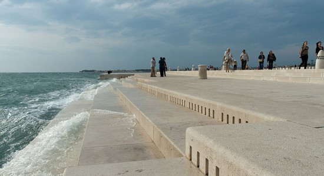

Órgano de Mar (Morske Orgulje) de Nikola Bašić (5.)

Se trata de un instrumento musical arquitectónico que utiliza la fuerza de las olas del mar para generar música. Consiste en un sistema de escaleras que descienden hacia el mar, dentro de las cuales se han instalado 35 tubos de polietileno de distintos tamaños, que están conectados a resonadores situados bajo las escaleras. 
Cuando el viento y las olas empujan el aire y el agua hacia los tubos, éstos actúan como un órgano, produciendo notas y acordes aleatorios y armónicos, liberando el sonido por unas aberturas dispuestas en el pavimento superior de las escaleras.

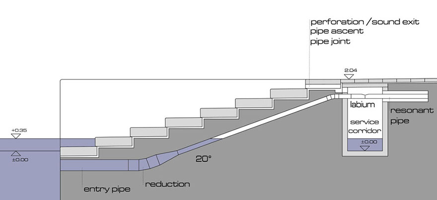

Órgano de Mar (Morske Orgulje) de Nikola Bašić. Corte Transversal (5.)

El resultado es una melodía en constante cambio, dictada por el ritmo y la fuerza del mar, creando una experiencia acústica única y ligada al entorno natural.

<iframe width="560" height="315" src="https://www.youtube.com/embed/YREFMRGMzLU?si=YCYnhTBZDb_W8KiY" title="YouTube video player" frameborder="0" allow="accelerometer; autoplay; clipboard-write; encrypted-media; gyroscope; picture-in-picture; web-share" referrerpolicy="strict-origin-when-cross-origin" allowfullscreen></iframe>

## Capilla del hotel de Ecotono en Biwako, Japon - Sonido del Viento de Ryuichi Ashizawa Architects

Otro ejemplo fascinante de arquitectura que utiliza los estímulos auditivos para crear una conexión no visual con la naturaleza es la Capilla "Sound of Wind" (Sonido del Viento), parte del Hotel de Ecotono en Biwako, Japon, de Ryuichi Ashizawa Architects.
La capilla fue diseñada para funcionar como un instrumento musical gigante tocado por el viento natural que sopla desde el cercano Lago Biwa.

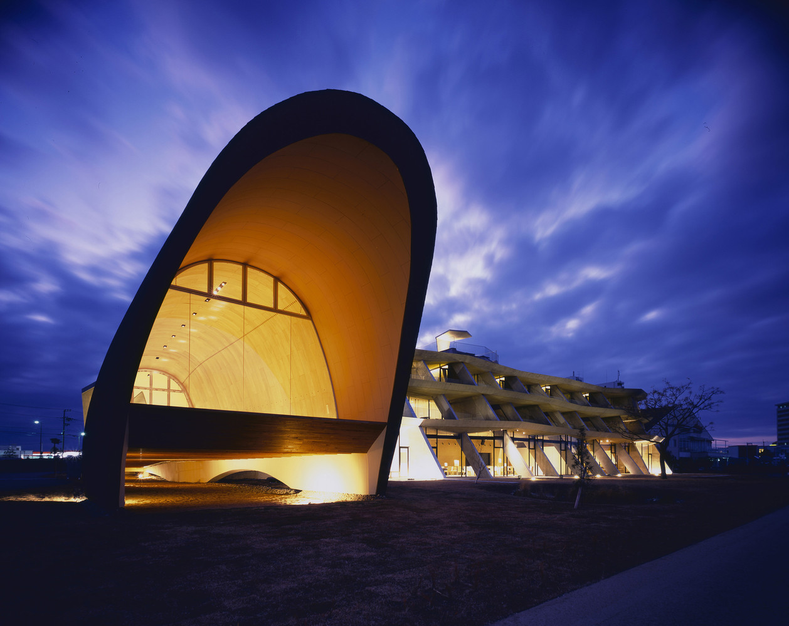

 Capilla del hotel de Ecotono de Ryuichi Ashizawa Architects (6.)

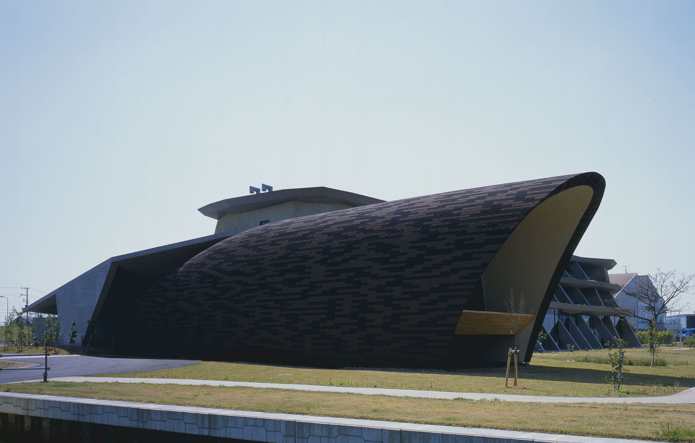

 Capilla del hotel de Ecotono de Ryuichi Ashizawa Architects (6.)

La arquitectura transforma la energía cinética del viento en sonido a través de un mecanismo que implica tensar cuerdas finas de acero inoxidable en la parte superior de la estructura; el viento incide sobre ellas, creando una turbulencia que hace que las cuerdas vibren y resuenen, amplificándose dentro de la cámara de madera contrachapada delgada, con una forma curva continua. 

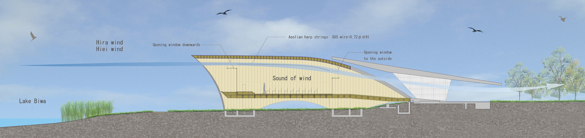

 Capilla del hotel de Ecotono de Ryuichi Ashizawa Architects. Corte Longitudinal (6.)

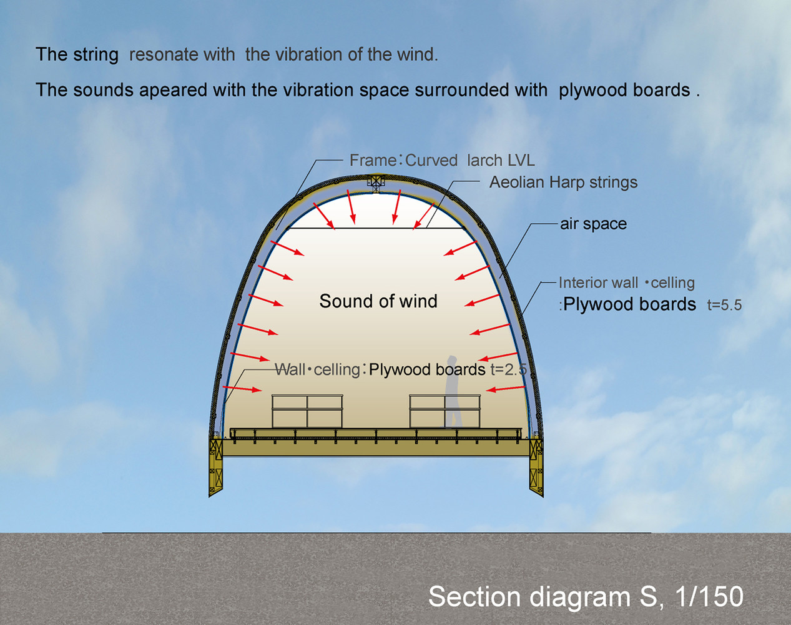

 Capilla del hotel de Ecotono de Ryuichi Ashizawa Architects. Corte Transversal (6.)

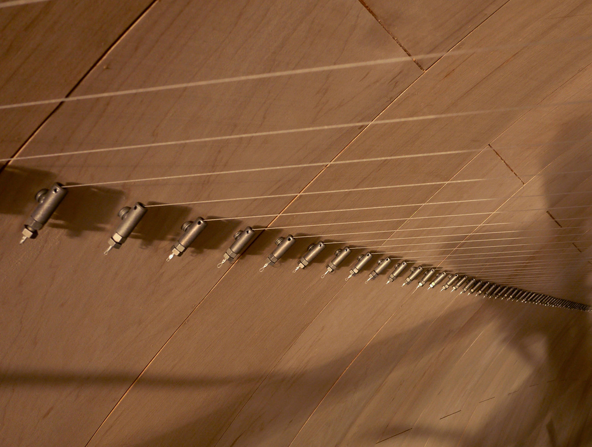

 Capilla del hotel de Ecotono de Ryuichi Ashizawa Architects (6.)

Este sonido siempre cambiante, refleja la intensidad del viento y las condiciones meteorológicas en tiempo real, estableciendo un vínculo íntimo y contemplativo entre el humano y su entorno. El visitante se vuelve consciente de la presencia y la intensidad de las fuerzas naturales que lo rodean. 

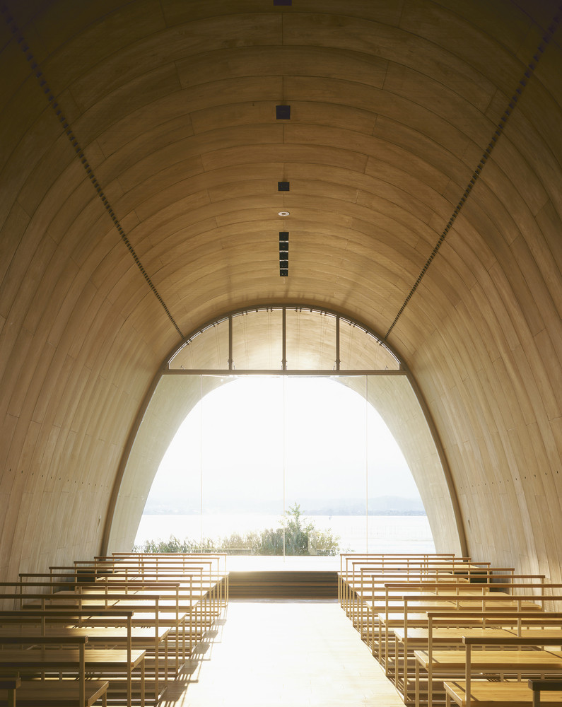

 Capilla del hotel de Ecotono de Ryuichi Ashizawa Architects (6.)

Además, la ubicación privilegiada de la capilla frente al lago garantiza que el sonido natural y rítmico del agua y las olas del Biwa se integre constantemente en la experiencia auditiva del espacio, reforzando la conexión no visual con el entorno acuático y atmosférico circundante.

<iframe width="560" height="315" src="https://www.youtube.com/embed/HKVz0ipyCBU?si=i1xgClFiWQjouDXN" title="YouTube video player" frameborder="0" allow="accelerometer; autoplay; clipboard-write; encrypted-media; gyroscope; picture-in-picture; web-share" referrerpolicy="strict-origin-when-cross-origin" allowfullscreen></iframe>

# Estímulos olfativos y gustativos

<blockquote style="margin-left: 30px;">
  <i>"Existe una sutil transferencia entre las experiencias táctiles y las gustativas. La vista también se transfiere al gusto; ciertos colores y detalles delicados evocan sensaciones orales. La lengua siente subliminalmente la superficie de una piedra pulida delicadamente coloreada. Nuestra experiencia sensorial del mundo se origina en la sensación interior de la boca y el mundo tiende a volver a sus orígenes orales. El origen más arcaico del espacio arquitectónico está en la cavidad bucal." (1.)</i>
</blockquote>

Juhani Pallasmaa. Los ojos en la piel. La arquitectura de los sentidos. P. 60

Saborear y oler es otra forma de experimentar la naturaleza y aprender sobre el entorno. La exposición a hierbas y flores aromáticas o aceites vegetales, además de la horticultura y jardinería, incluyendo plantas comestibles, son mecanismos para conectar con la naturaleza.

## Grow Residence en Calgary, Canadá de Modern Office of Design + Architecture (MODA)

La Grow Residence, diseñada por Modern Office of Design + Architecture (MODA), es un proyecto de vivienda multifamiliar ubicado en Calgary, Canadá. La residencia incorpora espacios dedicados a la agricultura y el cultivo compartido. 

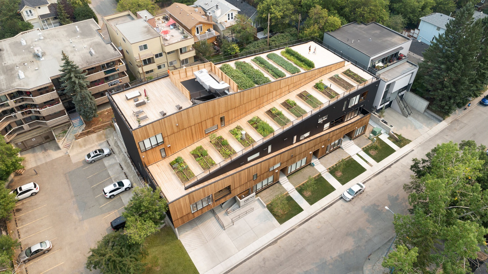

Grow Residence de Modern Office of Design + Architecture (MODA) (7.)

El diseño facilita la exposición a los aromas naturales generados por las plantas y hierbas cultivadas en los jardines comunes (por ejemplo, el olor de la tierra húmeda o las hierbas aromáticas como la menta o el romero). 
Además, concede la posibilidad de cultivar alimentos comestibles (frutas, verduras, hierbas) en los espacios de jardinería compartida y permite a los residentes interactuar con la naturaleza mediante el consumo de sus productos, experimentando el sabor de los alimentos cultivados in situ y estableciendo un vínculo directo.

Grow Residence de Modern Office of Design + Architecture (MODA) (7.)

Este enfoque va más allá de la mera estética verde, utilizando los sentidos del olfato y el gusto para crear un lazo profundo y multisensorial con el entorno y, al mismo tiempo, fomentar la interacción social a través de la actividad comunitaria de cultivar y cosechar.

Grow Residence de Modern Office of Design + Architecture (MODA) (7.)

# Estímulos Táctiles

<blockquote style="margin-left: 30px;">
  <i>"La piel lee la textura, el peso, la densidad y la temperatura de la materia. La superficie de un objeto viejo, pulido hasta la perfección por la herramienta del artesano y las manos diligentes de sus usuarios, seduce a la caricia de la mano." (1.)</i>
</blockquote>

Juhani Pallasmaa. Los ojos en la piel. La arquitectura de los sentidos. P. 58

Los estímulos táctiles naturales son una poderosa herramienta de conexión. Estos se manifiestan en la rugosidad de la piedra, la calidez de la madera, la suavidad de la piel, los textiles que imitan estas sensaciones, y la presencia reconfortante de mascotas.

## Café Zolaism, en Aranya, China de B.L.U.E. Architecture Studio

El Café Zolaism, diseñado por B.L.U.E. Architecture Studio en Aranya, China, es un ejemplo notable de arquitectura sensorial, que introduce formas naturales y orgánicas, contrastando con la rigidez del entorno urbano y creando una experiencia espacial que se siente primitiva, vasta y acogedora al mismo tiempo.

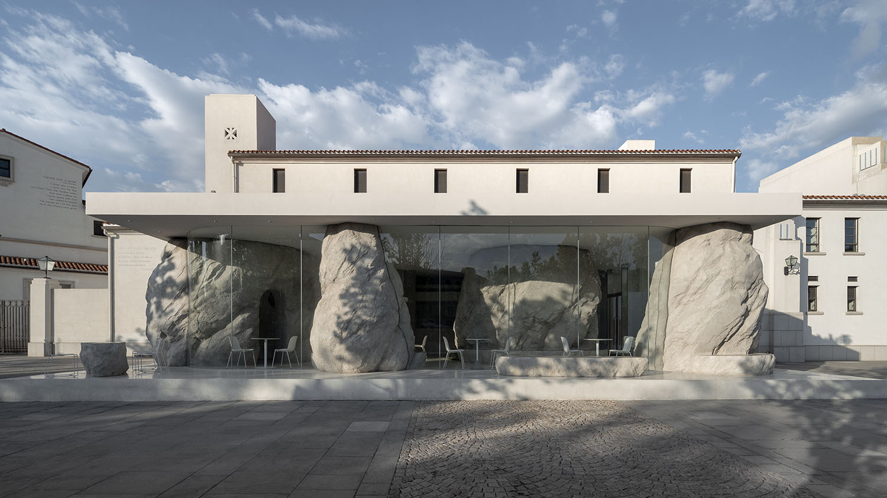

Café Zolaism de B.L.U.E. Architecture Studio (8.)

El elemento central de la experiencia táctil son las enormes estructuras internas con apariencia de roca, que no son piedras naturales, sino que están fabricadas con GRC (Hormigón Reforzado con Fibra de Vidrio), lo que permite replicar la textura natural, rugosa y pesada de la roca. 
Las grandes rocas no son solo decorativas; funcionan como estructuras, ayudan a dividir el espacio e incluso incorporan asientos fijos en su base, forzando la interacción física directa. Los usuarios pueden sentarse y apoyarse en estas formas, sintiendo la frialdad y la aspereza de la superficie con su cuerpo. 
La disposición libre y aparentemente improvisada de las rocas guía el movimiento de los visitantes. Caminar entre ellas crea un flujo abierto y dinámico, ofreciendo una experiencia espacial constantemente cambiante que estimula los sentidos, a diferencia de la rígida estructura de columnas tradicionales.

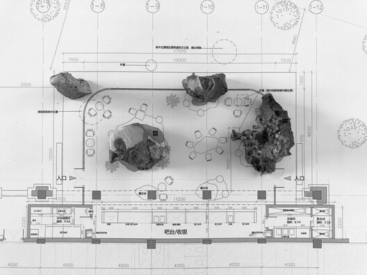

Café Zolaism de B.L.U.E. Architecture Studio. Planta (8.)

La superficie de estas "rocas" de GRC se presenta con una textura gruesa y áspera, evocando la sensación de tocar la piedra natural erosionada por el tiempo. Este acabado intencionalmente rudo y pesado contrasta fuertemente con la ligereza y transparencia del vidrio que envuelve el café.
La rugosidad y la forma de roca transmiten una sensación de fuerza, solidez y permanencia, estimulando la mano a explorar los contornos irregulares y las imperfecciones de las formas.
La piel rugosa de las rocas contrasta con las superficies ultra-claras y lisas del vidrio circundante, lo que amplifica la experiencia táctil de la piedra al hacerla el punto focal de la materialidad interior.

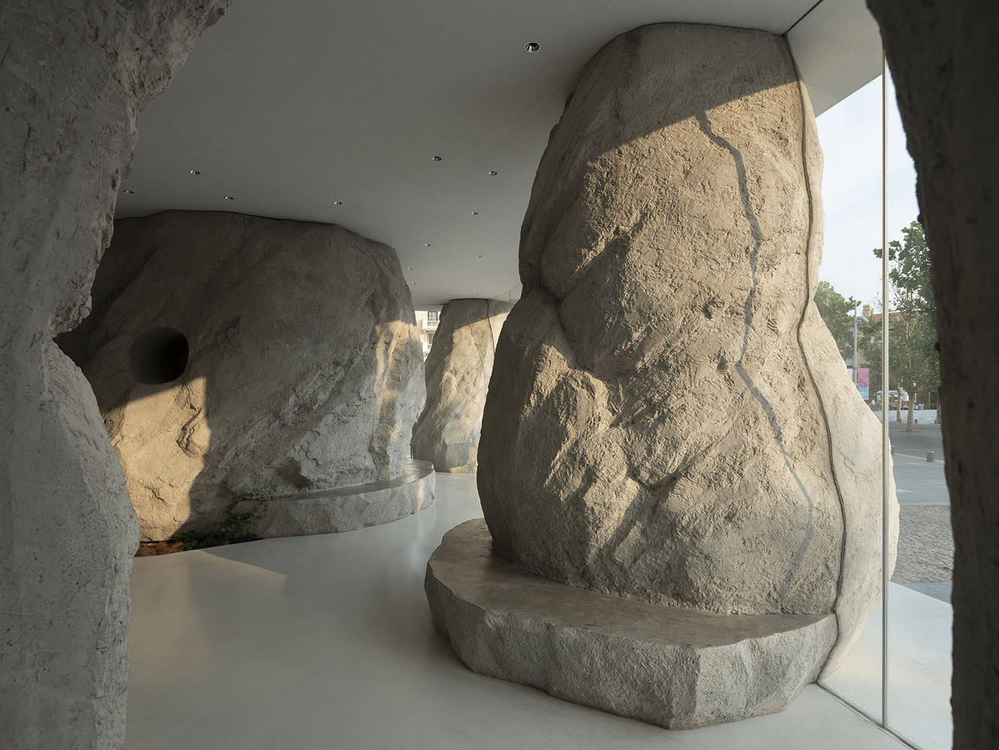

Café Zolaism de B.L.U.E. Architecture Studio (8.)

El uso de estas formas y texturas, junto con la luz natural que las baña a través de los muros de cristal, ofrece un espacio perceptual que apela directamente a las emociones y a la intuición, más allá de la lógica funcional.

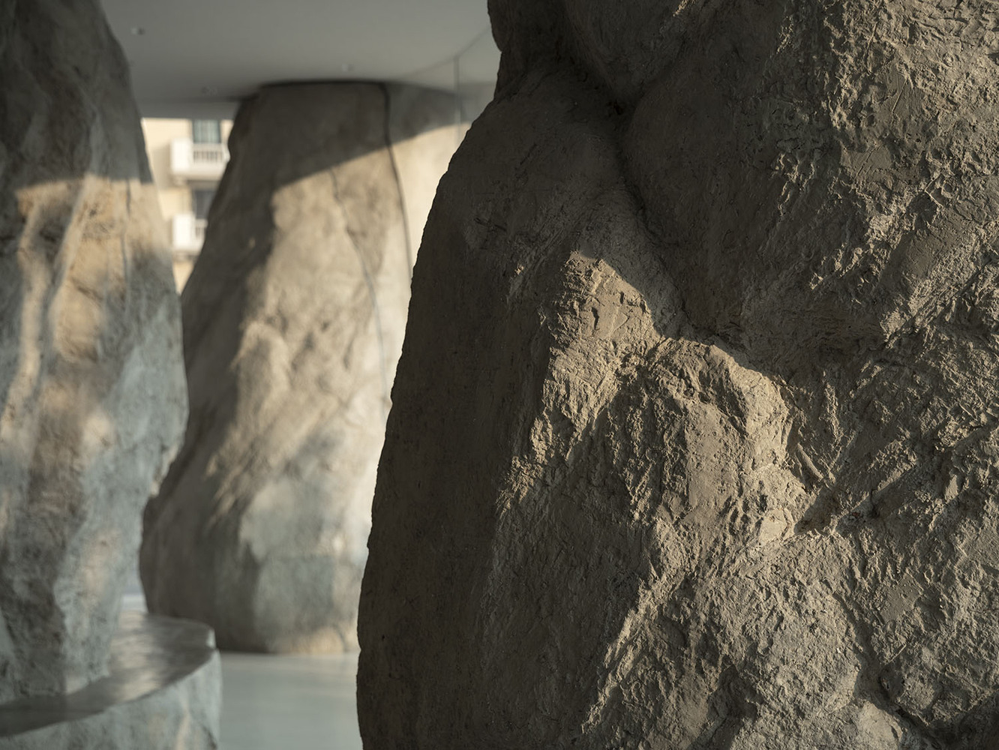

Café Zolaism de B.L.U.E. Architecture Studio (8.)

Referencias / Bibliografía:

1. Pallasmaa, J. (2006). Los ojos de la piel. La arquitectura y los sentidos. Barcelona: Editorial Gustavo Gili
2. Browning, W.D., Ryan, C.O., Clancy, J.O. (2017). 14. Patterns of Biophilic Design [14 Patrones de diseño biofílico] (Liana Penabad-Camacho, trad.) New York: Terrapin Bright Green, LLC (Trabajo original publicado en 2014).
3. Bear, I. J. y Thomas, R. G. (1964). Nature of Argillaceous Odour. Nature, Vol. 201, No. 4923, pp. 993-995.
4. Morisawa, T., Hanyu, K., Mori, H. y Tamura, K. (2017). Physiological and Psychological Effects of Scent of Soil on Human Beings. Open Journal of Soil Science, 7, 235-244
5. https://tysmagazine.com/arquitecto-croata-disena-un-organno-que-convierte-las-olas-del-mar-en-musica/
6. https://www.archdaily.cl/cl/758854/hotel-de-ecotono-en-biwako-sonido-del-viento-ryuichi-ashizawa-architects
7. https://www.archdaily.com/1018234/grow-residence-modern-office-of-design-plus-architecture
8. https://www.archdaily.com/973435/zolaism-cafe-blue-architecture-studio

