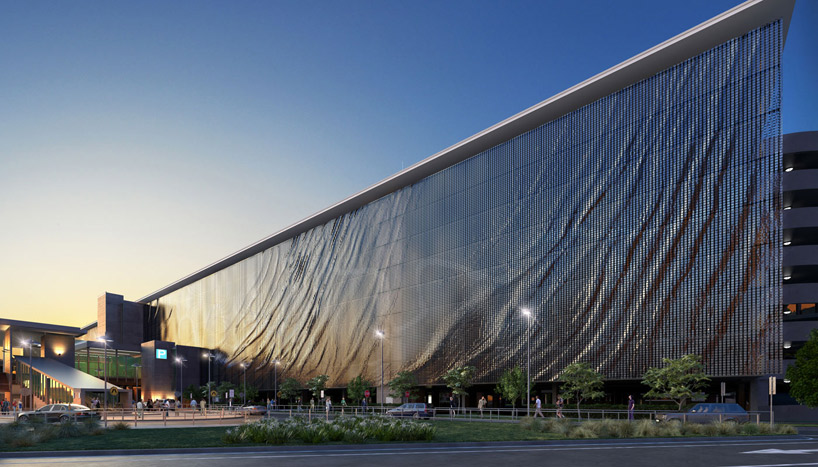
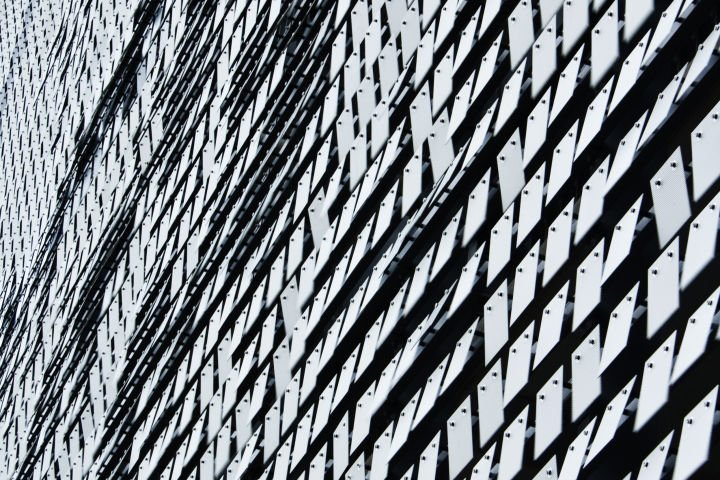
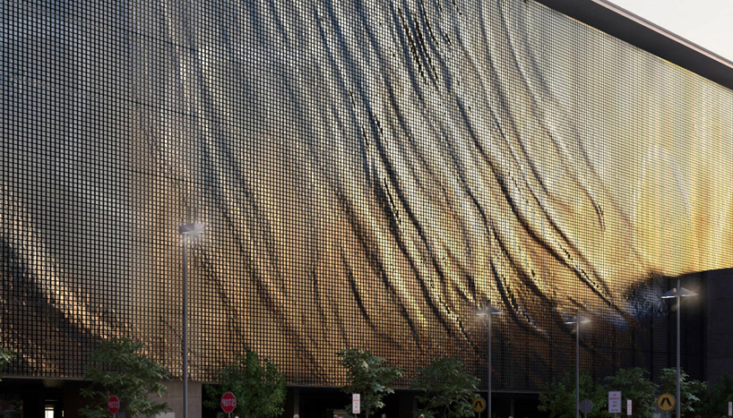
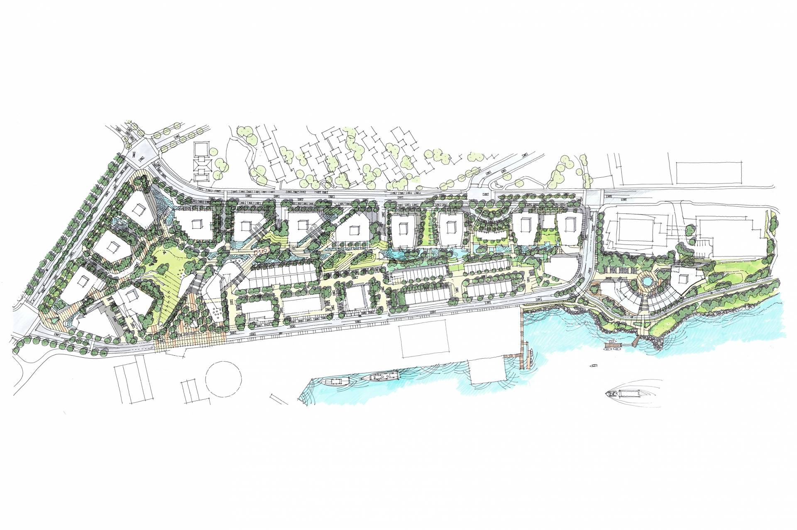
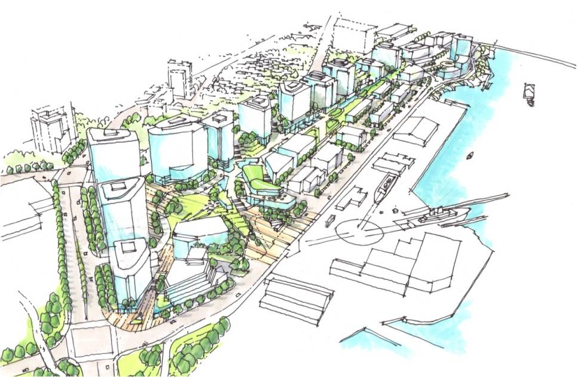
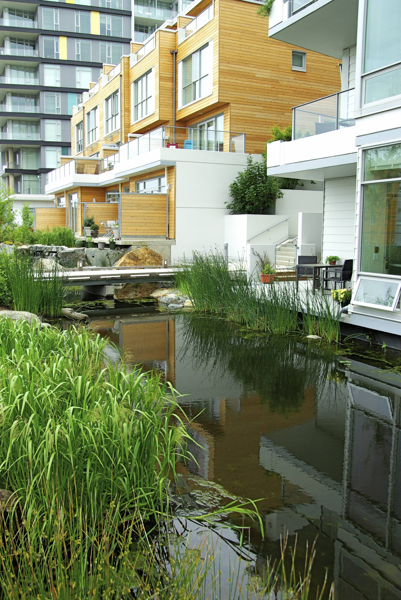
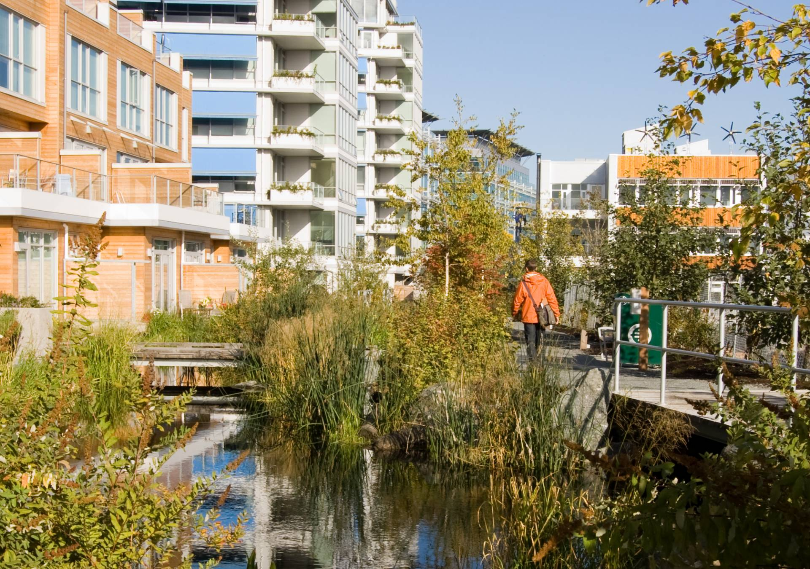

La incorporación de elementos que tengan un movimiento, sonido o cambio aleatorio, fugaz e impredecible, similar a la variabilidad que se encuentra en la naturaleza, ofrece una distracción breve y agradable que captura nuestra atención de forma suave e involuntaria, permitiendo que la mente descanse de la concentración activa y restaurando la capacidad de atención.

Estos elementos pueden ser telas que se mueven o brillan con la luz o la brisa, sombras o puntos de luz que cambian con el tiempo, sonidos de la naturaleza como el canto de aves, el murmullo del agua o su reflejos sobre una superficie; el aroma de flores, árboles y hierbas, el movimiento de las nubes, de insectos y animales, por ejemplo, mediante plantas que atraigan abejas, mariposas y otros polinizadores.

# La importancia de los eventos aleatorios para la restauración de la atención 

La exposición a conexiones aleatorias y efímeras con la naturaleza que no pueden predecirse con precisión, se vincula estrechamente con la Teoría de la Restauración de la Atención (ART) (1.) de Rachel y Stephen Kaplan, la cual postula que la atención dirigida y voluntaria, necesario para el procesamiento de la información y la eficacia humana, es un recurso finito propenso a la fatiga. Según los estudios de Kaplan, el esfuerzo prolongado por inhibir distracciones en entornos predecibles o demandantes deriva en un agotamiento mental que afecta la memoria, la resolución de problemas y el control de la irritabilidad. 

Para descansar de la atención dirigida, es necesario encontrar otra base para mantener la concentración mediante un modo alternativo de atención involuntaria, que no requiera esfuerzo y sea resistente a la fatiga. Los entornos naturales ofrecen recursos importantes para cautivarnos, ya que la naturaleza está ciertamente repleta de muchos procesos que encontramos atractivos y que captan fácilmente nuestro interés de una manera discreta. 

Los estímulos no rítmicos, como el roce de las plantas por la brisa, las puestas de sol o el vuelo de los insectos y las aves proporcionan lo que Kaplan denomina "fascinación suave", un modo de atención que permite que el mecanismo de atención dirigida descanse y se recupere. Observar, oír y sentir estos patrones es fácil y deja amplias oportunidades para pensar en otras cosas, ayudando a la mente a reponer sus recursos agotados y mejorando la capacidad de las personas para enfocarse nuevamente en sus tareas. Además, la fascinación suave, tiene la ventaja especial de brindar una ocasión para la reflexión, lo que puede potenciar aún más los beneficios de la restauración cognitiva.

La restauración lograda mediante estos estímulos naturales facilita la recuperación de la función ejecutiva, la cual es indispensable para llevar una vida organizada y con propósito, ya que permite al individuo volver a seleccionar información relevante y planificar de manera efectiva. Además, este proceso de recuperación reduce la irritabilidad y la tendencia a tomar riesgos innecesarios o actuar de forma impulsiva, comportamientos que son sellos distintivos de la fatiga mental. Al interactuar con estos elementos naturales imprevistos de fascinación suave, se fortalece la capacidad de inhibición voluntaria, considerada el eje central de la salud y el comportamiento adaptativo, lo que permite al ser humano manejar las presiones del entorno moderno y recuperar su efectividad general.

Kaplan argumenta que el sistema nervioso humano evolucionó en entornos donde estar alerta a cambios sutiles y fascinantes en el entorno era vital, por lo que estas experiencias, incluso cuando son breves o microrestaurativas, facilitan una existencia más saludable y vibrante al reducir la vulnerabilidad a la fatiga mental y el estrés. De este modo, la presencia de estos estímulos en el diseño ayuda a mitigar la desconexión con la naturaleza y previene el deterioro de la efectividad humana, permitiendo que el individuo recupere su capacidad de procesar información de manera coherente y organizada

<blockquote style="margin-left: 30px;">
  <i>"...cualquier esfuerzo mental prolongado conduce a la fatiga de la atención dirigida. Podría parecer extraño que un mecanismo tan íntimamente relacionado con la eficacia humana fuera tan susceptible a la fatiga. Sin embargo, desde una perspectiva evolutiva, esta aparente limitación podría haber sido bastante razonable. Poder prestar atención por elección propia a una cosa en particular durante un largo período de tiempo nos haría vulnerables a las sorpresas. Estar vigilante, estar atento al entorno, puede haber sido mucho más importante que la capacidad de concentración prolongada e intensa. Además, mucho de lo que era importante para el ser humano en evolución —animales salvajes, peligro, cuevas, sangre, por nombrar algunos ejemplos— era (y sigue siendo) innatamente fascinante y, por lo tanto, no requiere atención dirigida. Solo en el mundo moderno la división entre lo importante y lo interesante se ha vuelto extrema. Con demasiada frecuencia, el ser humano moderno debe esforzarse por hacer lo importante, a la vez que resiste la distracción de lo interesante. Por lo tanto, el problema de la fatiga de la atención dirigida bien puede ser de origen relativamente reciente."</i>
</blockquote>

Stephen Kaplan. The restorative benefits of nature: Toward an integrative framework. P. 170

# ¿Por qué percibimos mejor los movimientos espontáneos que los patrones repetitivos?

El destacado neurocientífico especializado en los mecanismos cerebrales de la percepción y la comunicación humana, Michael S. Beauchamp, explica la base neurológica de por qué preferimos ver una hoja moviéndose al viento que un péndulo de reloj.

Según los estudios de Beauchamp, el cerebro no procesa todos los movimientos por igual, si no que posee una eficiencia de procesamiento mucho mayor para el movimiento natural en comparación con el mecánico. Mientras que los estímulos biológicos —como el desplazamiento de animales o el vaivén de las plantas— se integran de forma automática, fluida y coherente en áreas cerebrales especializadas, el movimiento mecánico suele ser ignorado o percibido como una distracción molesta. 

El surco temporal superior (STS)  se activa de manera selectiva y potente ante el movimiento de seres vivos (especialmente humanos), ya que presenta una preferencia marcada por movimientos con múltiples grados de libertad, integrando de manera más robusta la forma, el color y el movimiento en comparación con estímulos simples o no articulados. Esta especialización facilita una identificación más eficiente y coherente de los objetos, ya que el cerebro opera como un dispositivo de aprendizaje asociativo que vincula movimientos característicos con rasgos visuales y auditivos. Además, cuando estos estímulos no mecánicos se presentan de forma multimodal (como al observar un movimiento biológico mientras se escucha su sonido natural), se produce una potenciación o mejora multimodal en la región pSTS/MTG, generando una respuesta neuronal significativamente mayor que la suma de las percepciones individuales. De este modo, el sistema nervioso está intrínsecamente diseñado para procesar e integrar información sensorial compleja y no rígida, lo que permite una identificación de objetos más rápida y una comprensión del entorno más profunda que la obtenida mediante estímulos puramente predecibles o mecánicos. (2.) (3.)  (4.)

Los objetos inanimados que se mueven (como herramientas o máquinas) activan principalmente el giro temporal medio (MTG) y el surco temporal inferior (ITS), áreas que conforman el flujo especializado en el procesamiento de herramientas y movimientos de cuerpo rígido. El movimiento mecánico o no biológico a menudo se percibe como una "distracción" o requiere más esfuerzo cognitivo cuando compite con estímulos sociales. Si un movimiento mecánico es repetitivo y carece de la fluidez biológica (aceleraciones y desaceleraciones naturales), el cerebro tiende a categorizarlo como ruido ambiental o, si es muy prominente, como un estímulo que interrumpe el flujo de atención natural.

Aunque Beauchamp es un neurocientífico puro, sus hallazgos son la base de teorías en diseño que afirman que los entornos con movimientos naturales (como el balanceo de las hojas o el movimiento del agua) mantienen al cerebro en un estado de "atención suave" o restauradora. En contraste, los movimientos mecánicos rígidos (como un ventilador ruidoso o luces parpadeantes) provocan fatiga cognitiva porque el cerebro debe esforzarse activamente por ignorarlos o procesarlos como "objetos" sin relevancia social.

## Membrana cinética del Aeropuerto de Brisbane, en Queensland, Australia de Ned Kahn + UAP

Fachada del Aeropuerto de Brisbane, en Queensland, Australia de Ned Kahn + UAP. (1.)

La obra es una fachada cinética, compuesta por pequeños paneles cuadrados de aluminio, suspendidos libremente y articulados a la estructura del edificio mediante una bisagra, sin requerir de motores ni electricidad para el movimiento, solo de la fuerza del viento que atraviesa la estructura y empuja los paneles, haciéndolos oscilar.

Paneles de Aluminio que Conforman la Fachada del Aeropuerto de Brisbane. (2.)

El viento no sopla de manera constante ni uniforme, las ráfagas y brisas tienen variaciones aleatorias en velocidad y dirección, se produce así, un patron que cambia continuamente, evitando la fatiga sensorial o la sensación de aburrimiento que generaría un ritmo mecánico repetitivo.

Fachada del Aeropuerto de Brisbane, en Queensland, Australia de Ned Kahn + UAP. (3.)

El movimiento colectivo de las miles de placas crea un efecto visual hipnótico que simula el movimiento de los fluidos naturales, como las ondas del agua, las nubes en movimiento o el soplido del viento sobre el pasto. (5.)

<iframe width="560" height="315" src="https://www.youtube.com/embed/6nuZI4UIK68?si=qZCiE5sKXGL8nk6P" title="YouTube video player" frameborder="0" allow="accelerometer; autoplay; clipboard-write; encrypted-media; gyroscope; picture-in-picture; web-share" referrerpolicy="strict-origin-when-cross-origin" allowfullscreen></iframe>

## Comunidad Dockside Green en la Isla Vancouver, Canadá de Busby Perkins and Will

La comunidad Dockside Green en la Isla de Vancouver (Victoria, Columbia Británica, Canadá), diseñada por Busby Perkins and Will, es un desarrollo urbano sostenible reconocido por la integración de la naturaleza en el entorno construido. 
Diseñados para maximizar la variabilidad natural y priorizar la biodiversidad, estos espacios y senderos verdes cuentan con una vegetación nativa y extensa que crea un entorno único para recientes y visitantes.

Comunidad Dockside Green en la Isla Vancouver, Canadá de Busby Perkins and Will (4.)

Comunidad Dockside Green en la Isla Vancouver, Canadá de Busby Perkins and Will (5.)

El estanque Greenway recibe y trata el agua de lluvia y las aguas negras de la comunidad, que circula a través de una serie de humedales y elementos de tratamiento natural antes de llegar al estanque. Éste, con su superficie en constante movimiento y las plantas acuáticas, crea reflejos de luz dinámicos en las fachadas de los edificios y en los caminos adyacentes.
El desplazamiento y el sonido de la corriente, al fluir sobre diferentes superficies (rocas, grava, vegetación acuática), cambia con la intensidad de la lluvia, la velocidad del flujo y la interacción con los elementos naturales, imitando un arroyo o riachuelo natural.

Comunidad Dockside Green en la Isla Vancouver, Canadá de Busby Perkins and Will (6.)

Al reintroducir un ecosistema de humedal funcional, el parque atrae vida silvestre como aves e insectos. Los movimientos inesperados y los sonidos de los animales, como el aleteo de un ave o el canto de un sapo, son eventos aleatorios, que aportan dinamismo al paisaje urbano.
Además, dada la heterogeneidad de las especies y sus distintas rigideces y formas, el viento induce una agitación sumamente compleja y desorganizada en sus hojas y ramas.

En definitiva, son los procesos ecosistémicos reales, como el flujo del agua, la oscilación de la vegetación y la presencia de vida, los principales generadores de una experiencia sensorial cambiante y orgánica. (6.)

Comunidad Dockside Green en la Isla Vancouver, Canadá de Busby Perkins and Will (7.)

Referencias / Bibliografía:

1. Kaplan, S. (1995). The restorative benefits of nature: Toward an integrative framework. Publicado en el Journal of Environmental Psychology, volumen 15, páginas 169–182.

2. Beauchamp, M. S., Lee, K. E., Haxby, J. V., & Martin, A. (2002). Parallel Visual Motion Processing Streams for Manipulable Objects and Human Movements. Publicado en la revista Neuron, volumen 34, páginas 149–159.

3. Beauchamp, M. S., Lee, K. E., Haxby, J. V., & Martin, A. (2003). fMRI Responses to Video and Point-Light Displays of Moving Humans and Manipulable Objects. Publicado en el Journal of Cognitive Neuroscience, volumen 15, número 7, páginas 991–1001.

4. Beauchamp, M. S., Lee, K. E., Argall, B. D., & Martin, A. (2004). Integration of Auditory and Visual Information about Objects in Superior Temporal Sulcus. Publicado en la revista Neuron, volumen 41, número 5, páginas 809–823.

5. https://www.uapcompany.com/projects/turbulent-line

6. https://www.pwlpartnership.com/case-studies/dockside-green

Imágenes:

1. https://images.adsttc.com/media/images/5d54/1ad9/284d/d16c/1200/0065/large_jpg/header-profolio.jpg?1565792980

2. https://www.uapcompany.com/generated/720w-3-2/turbulent-line-ned-kahn-09-jpg.jpg?1613627250

3. https://static.designboom.com/weblog/images/images_2/rodrigo/09_september_2012/01_kineticFacade/airport_02.jpg

4. https://www.pwlpartnership.com/sites/default/files/styles/landing_image_desktop/public/1378%2020140716%20plan_colour-reduced.jpg?itok=J86TL3xT

5. https://www.pwlpartnership.com/sites/default/files/styles/max_650x650/public/2020-02/1378%2020140715%20perspective%202_colour.jpeg?itok=z6aSLkX0

6. https://www.pwlpartnership.com/sites/default/files/styles/landing_image_desktop/public/treatment%20pond2%20high.jpg?itok=xqIHqQHk

7. https://www.pwlpartnership.com/sites/default/files/styles/landing_image_desktop/public/landing/20091002%20greenway%20with%20jason.jpg?h=9f2f9387&itok=wgKS-c2-