---
layout: post
title:  Variaciones Térmicas y de Corrientes de Aire
date:   2026-02-16
image:  ../img/variaciones-termicas/le-corbusier6.jpg
tags:   Cities
--- 

Las ligeras fluctuaciones en la temperatura, la humedad y las corrientes de aire perceptibles, son cambios sutiles y dinámicos que caracterizan a los entornos naturales. Esta variación sensorial moderada es fundamental, ya que las personas encuentran confort en la novedad y el estímulo, mientras que los ambientes completamente estáticos y carentes de cambio pueden llevar al aburrimiento y la monotonía. 

La arquitectura debe imitar el ambiente que se experimenta en exteriores, sin embargo, debido a que el confort térmico es subjetivo, es crucial darles a los ocupantes, un grado de control sobre su microambiente y diferentes niveles de acceso a condiciones ambientales variables, a traves de elementos como ventanas ajustables, ventiladores localizados, materiales de conductancia variable o estrategias como el uso de sistemas HVAC (Heating, Ventilating and Air Conditioning) o la ventilación cruzada, además de opciones para sentarse en interiores y exteriores, donde se puede elegir entre un lugar fresco a la sombra o uno soleado y cálido. (1.)

# Aliestesia espacial y confort dinámico: El impacto sensorial de los flujos térmicos en edificios.

La incorporación de cambios en la temperatura, la humedad relativa y el flujo de aire en entornos construidos para imitar los entornos naturales, representa un cambio de paradigma respecto al diseño arquitectónico tradicional, que ha buscado históricamente un "estado estable" o de neutralidad térmica mediante sistemas mecánicos.

Lisa Heschong, en su libro "Thermal Delight in Architecture" critica esta tendencia de la arquitectura contemporánea de crear ambientes con temperatura constante y compara estos sistemas automatizados con la "Cenicienta" de la arquitectura, relegados a tareas aburridas en habitaciones traseras y desplazados a un segundo plano a pesar de su enorme potencial. El libro propone que la función térmica de un edificio debe ser un elemento de diseño activo, similar a la luz o la estructura, y no simplemente una necesidad técnica delegada a mecanismos estandarizados. (2.)

<blockquote style="margin-left: 30px;">
  <i>"Las cualidades térmicas también podrían incluirse en la concepción inicial del arquitecto e influir en todas las fases del diseño. En cambio, las condiciones térmicas suelen estandarizarse mediante el uso de sistemas mecánicos modernos que pueden especificarse, instalarse y funcionar independientemente del concepto general del diseño. De hecho, los sistemas de control ambiental tienden a tratarse como la Cenicienta de la arquitectura: con la ropa más sencilla, se les relega a una trastienda para que se encarguen de las tareas pesadas que mantienen el elegante estilo de vida de las otras hermanas: luz, forma, estructura, etc."</i>
</blockquote>

Lisa Heschong en Thermal Delight in Architecture, Preface
 

 La autora argumenta que las cualidades térmicas (como lo cálido, lo fresco o lo acogedor) influyen profundamente en nuestro comportamiento y en cómo nos sentimos en un espacio y sostiene que un ambiente térmicamente neutro ignora la sensualidad y el papel cultural que el clima tiene en la vida humana. El sentido térmico nos proporciona información sobre el mundo que nos rodea, a través de él, exploramos y comprendemos nuestro entorno. Por ejemplo, al notar que una piedra está fría, deducimos que ha estado a la sombra; el calor de una taza de café, nos reconforta las manos y percibimos bienestar físico. Ser conscientes de estos pequeños detalles térmicos nos conecta con el exterior y nos brinda una profunda sensación de confort.

Heschong justifica la necesidad de variabilidad explicando que el sentido térmico humano no funciona como un sensor de temperatura absoluta, sino como un detector de flujo de calor que monitorea la rapidez con la que el cuerpo gana o pierde energía. Debido a que nuestro sistema nervioso está mucho más sintonizado para notar los cambios en el ambiente que para percibir los estados constantes, un entorno térmicamente uniforme suele conducir al aburrimiento, la pasividad y la insatisfacción sensorial. Por el contrario, el deleite térmico surge del contraste y el cambio, de manera similar a como un banquete gourmet ofrece una variedad de sabores para renovar constantemente las papilas gustativas. Desde la perspectiva de la arquitecta, «la experiencia de cada extremo se agudiza al contrastar con el otro» (Heschong, 1979, p. 22 ), sugiriendo que son precisamente las variaciones térmicas dentro de la "zona de confort" las que generan una verdadera satisfacción sensorial. Este placer es comparable con el gozo de encontrar una sombra fresca en un día caluroso o sentir el calor de una chimenea frente a una tormenta de invierno; momentos donde la arquitectura deja de ser un simple refugio para convertirse en una fuente de bienestar activo.

<blockquote style="margin-left: 30px;">
  <i>"La información térmica nunca es neutral; siempre refleja lo que le sucede directamente al cuerpo. Esto se debe a que las terminaciones nerviosas térmicas son sensores de flujo de calor, no de temperatura. No pueden determinar directamente la temperatura de algo; más bien, controlan la rapidez con la que nuestro cuerpo la pierde o la gana. A partir de esta información, juzgamos cuánto más frío o más caliente que la temperatura corporal está un objeto. Por ejemplo, si toco un trozo de madera y un trozo de metal que están a temperatura ambiente, el metal se sentirá más frío porque absorbe el calor de mi mano más rápidamente.

Siempre que la diferencia de temperatura no sea muy grande, nuestro cuerpo puede usar una de sus estrategias metabólicas para adaptarse a las nuevas condiciones y el estímulo térmico ya no será perceptible. Por lo tanto, cuando entro en una habitación cálida, noto al instante la temperatura del aire. Sin embargo, en pocos minutos me he adaptado y la habitación se siente normal. O mejor dicho, me siento normal en la habitación. Podríamos establecer un paralelismo con la fatiga que experimentan los demás sentidos (aunque el mecanismo no es el mismo). Solo podemos oler una rosa durante un tiempo antes de que el olor se desvanezca. Los sensores se saturan y la atención se centra en nueva información. Nuestro sistema nervioso está mucho más adaptado a percibir cambios en el entorno que a estados estables.

Una buena comida gourmet ofrece una amplia variedad de sabores —salado, dulce, picante, sabroso— para que las papilas gustativas se renueven y experimenten cada sabor con una nueva perspectiva. Este mecanismo de renovación parece ser especialmente activo para el sentido térmico cuando experimentamos un cambio de temperatura dentro de nuestra zona de confort básica. Existe un placer adicional en la deliciosa comodidad de un cálido día de primavera al caminar bajo una hilera de árboles y sentir la alternancia de calor y frescor del sol y la sombra."</i>
</blockquote>

Lisa Heschong en Thermal Delight in Architecture, Pag. 19

Esta búsqueda del placer a través de la variabilidad encuentra su respaldo científico en las investigaciones de Thomas Parkinson y Richard de Dear sobre la aliestesia espacial (definida como el fenómeno donde un estímulo térmico se percibe como placentero o desagradable dependiendo del estado interno del sujeto) en ambientes construidos, generada por el movimiento del aire. (3.)

Esta hipótesis propone que el placer térmico no es simplemente un estado de neutralidad, sino que surge cuando un estímulo localizado, como una brisa, ayuda a corregir un desequilibrio o "error de carga" térmico en el cuerpo. A diferencia de los modelos tradicionales de confort que a menudo ven el movimiento del aire como un riesgo de corrientes molestas, este estudio busca entender los beneficios positivos de una brisa deseada en condiciones de calor. Para comprobar este postulado, se llevó a cabo un experimento donde se expuso a sujetos a condiciones cálidas de forma previa a la prueba. Los participantes pasaron 30 minutos sentados en una cámara climática a una temperatura de 27.5°C para generar una carga térmica antes de ser expuestos a diferentes patrones de movimiento de aire dirigidos específicamente a la parte posterior del cuello mediante ventiladores personales. Cada exposición a un patrón duró cinco minutos en una secuencia cuasi aleatoria, mientras se medía la temperatura de la piel del cuello cada cinco segundos y se registraban los votos de sensación y placer térmico global de los sujetos a través de una aplicación en una tableta. El objetivo era observar cómo estos perfiles locales afectaban la sensación y el placer térmico global.

Los resultados de estas mediciones mostraron que el movimiento del aire redujo la temperatura de la piel del cuello en aproximadamente 2.2°C en promedio, lo que provocó un aumento significativo en el placer térmico y una disminución de la sensación de calor en todo el cuerpo en comparación con el estado previo al uso de los ventiladores. Los hallazgos de Parkinson y de Dear confirman que la estimulación de un solo sitio de la piel es capaz de influir en la percepción térmica de todo el cuerpo, logrando que el sujeto pase de un estado de malestar a uno de satisfacción. El análisis por grupos reveló además que la intensidad del placer sentido es directamente proporcional al malestar previo; es decir, cuanto más acalorada se siente una persona inicialmente, mayor es el deleite que experimenta ante una corriente de aire fresca, lo que refuerza que el placer depende del estado interno del sujeto. Esto se debe a que los termorreceptores cutáneos son extremadamente sensibles a las tasas dinámicas de cambio, produciendo una respuesta neuronal mucho más potente durante las fluctuaciones térmicas que bajo condiciones estáticas.

En última instancia, la justificación de este patrón radica en que la arquitectura debe aspirar a algo más que la simple neutralidad para promover la salud y el bienestar fisiológico y cognitivo. Mientras que los estándares internacionales suelen clasificar el movimiento del aire o las asimetrías térmicas como "disconfort local", el marco de la aliestesia permite transformar estos estímulos en herramientas de diseño para generar alegría y vitalidad en los espacios habitados. La implementación de sistemas de Control Ambiental Personal (PEC) es una estrategia clave para lograr esto, ya que permite que cada individuo gestione sus propios contrastes térmicos y perfiles de enfriamiento, evitando la monotonía de los espacios compartidos y favoreciendo el ahorro energético al permitir rangos de temperatura más amplios en los edificios. Así, el diseño biofílico recupera la sensualidad y el simbolismo del entorno térmico, reconociendo que el contacto con las variaciones de la naturaleza es una necesidad biológica fundamental para el ser humano.

# Casos de estudio: La teoría aplicada al espacio

## Edificio de la Asociación de Propietarios de Mill (Mill Owners' Association Building) en Ahmedabad, India de Le Corbusier, 1951-1956

El Edificio de la Asociación de Propietarios de Mill en Ahmedabad, India, diseñado por Le Corbusier, es una obra fundamental de la arquitectura moderna que integra soluciones bioclimáticas para el confort térmico y la ventilación natural en un clima tropical cálido y húmedo. 

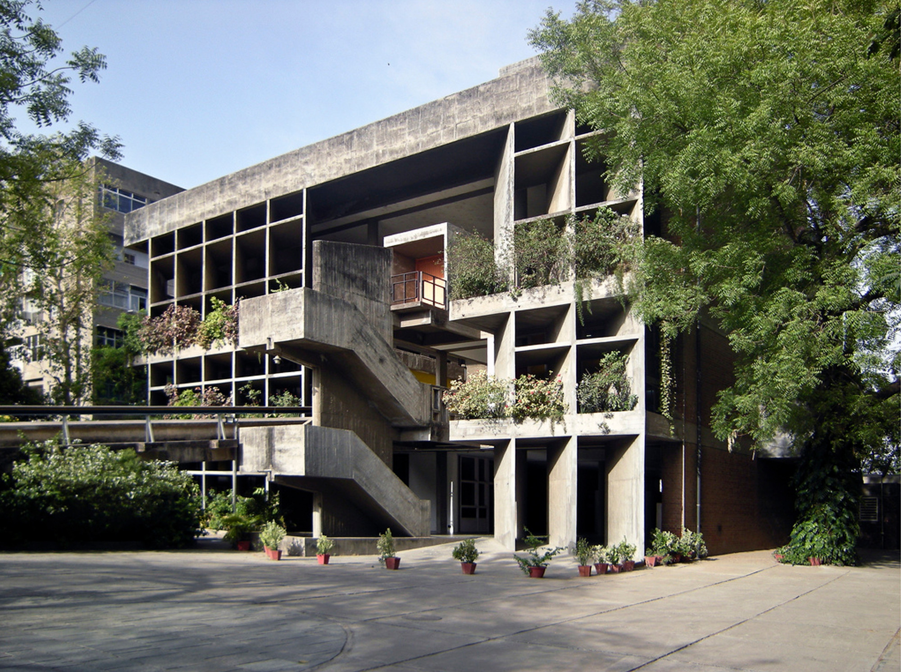

Palacio de Filateurs. Ahmedabad, India, 1951-1956
© motaleb architekten

Estructuralmente, se alza sobre pilotis de hormigón, liberando el nivel del suelo para la circulación del aire. El confort térmico se logra principalmente a través de la protección solar masiva mediante sus icónicos brises-soleil (quiebrasoles), que son grandes pantallas de hormigón ubicadas en las fachadas este y oeste. 

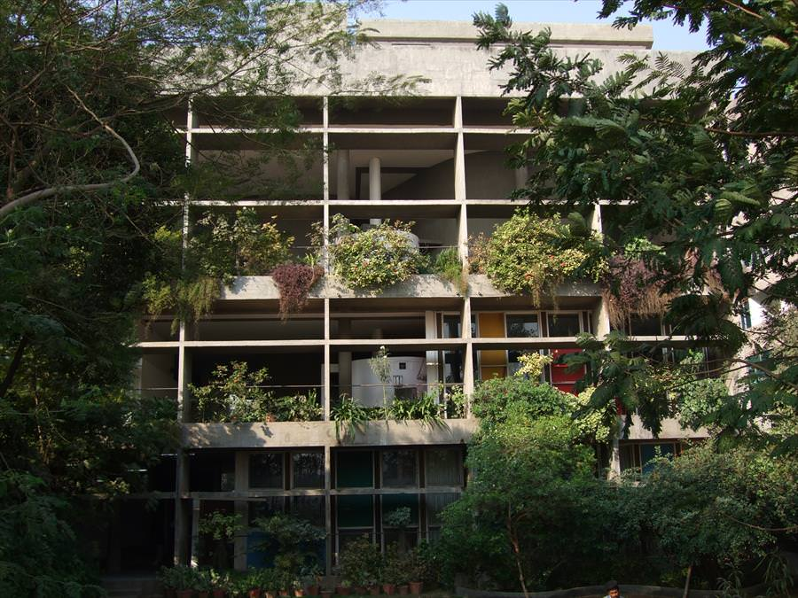

Palacio de Filateurs. Ahmedabad, India, 1951-1956
© FLC/ADAGP"

Estos dispositivos interceptan la luz solar directa y reducen significativamente la ganancia de calor sin obstruir completamente el flujo de aire o las vistas. En la cara oeste, los brises-soleil están orientados diagonalmente para mejorar la privacidad desde la calle, mientras que, en la parte trasera (este), son perpendiculares a la fachada para captar la brisa del río.

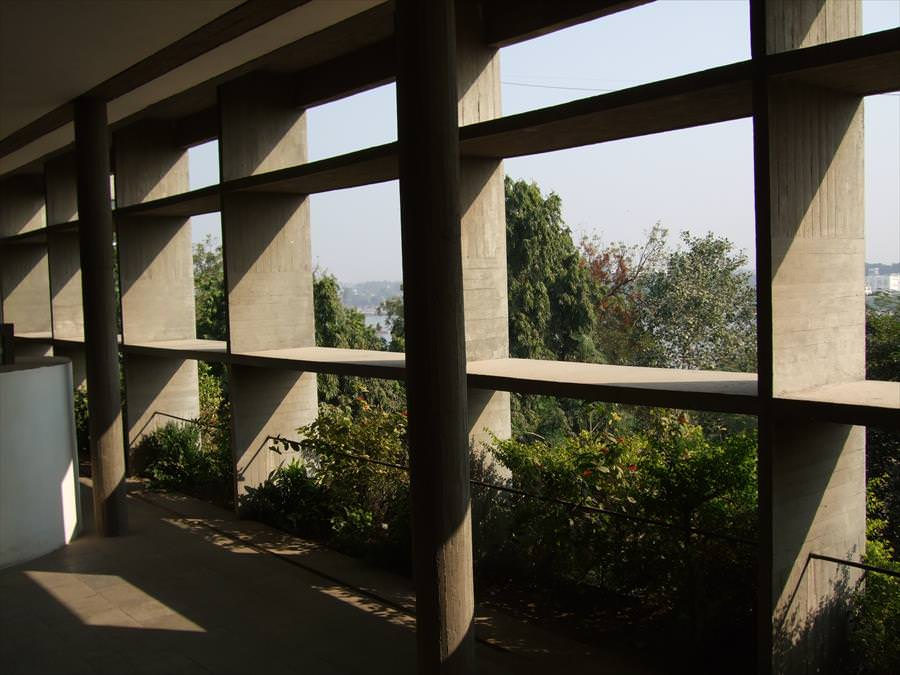

Palacio de Filateurs. Ahmedabad, India, 1951-1956
© FLC/ADAGP

Adicionalmente, el uso de hormigón en muros de alta masa térmica en las fachadas norte y sur ayuda a moderar las temperaturas interiores al absorber el calor durante el día y liberarlo por la noche.
La ventilación natural es una característica clave; el edificio está orientado para aprovechar los vientos dominantes. Las aberturas están estratégicamente protegidas por los brises-soleil, permitiendo que el aire fluya a través del edificio y refresque los espacios interiores. 

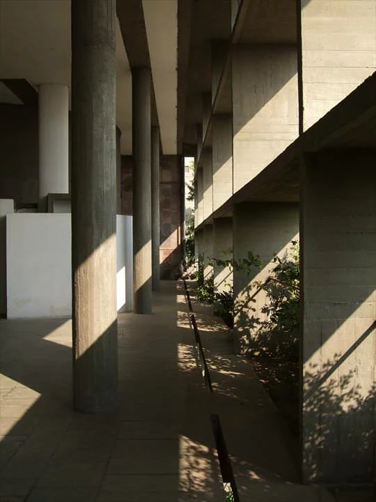

Palacio de Filateurs. Ahmedabad, India, 1951-1956
© FLC/ADAGP

La elevación del edificio mediante los pilotis y el diseño de la rampa ceremonial y el vestíbulo de triple altura también contribuyen a canalizar el aire, asegurando una circulación constante y controlada que maximiza la disipación del calor.

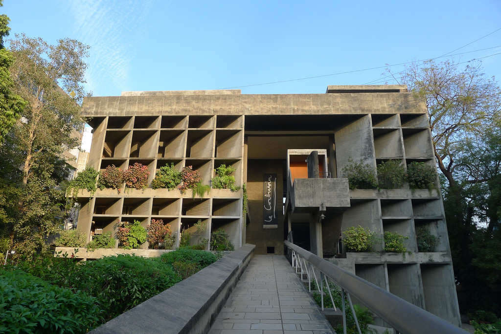

Palacio de Filateurs. Ahmedabad, India, 1951-1956
© panovscott

Por otro lado, la azotea incorpora un techo curvo con un jardín y un depósito de agua, que proporcionan refrigeración evaporativa y sombreado, mitigando la transferencia de calor. 

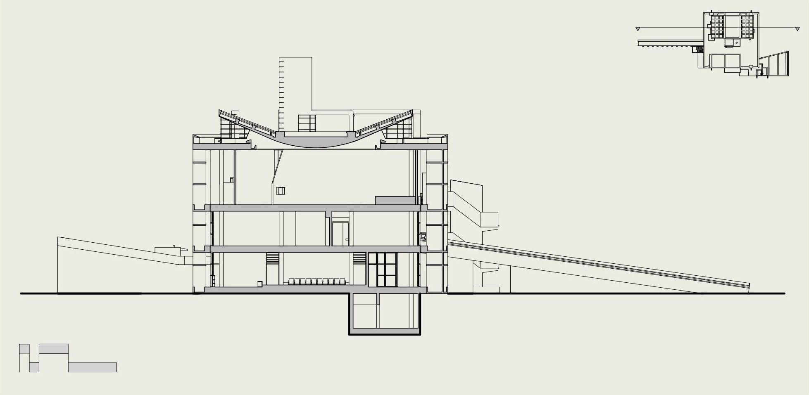

Palacio de Filateurs. Ahmedabad, India, 1951-1956
Corte Longitudinal. Tomado de _Le Corbusier’s Ahmedabad Millowners’ Association Building_ (4.)

El techo curvo se encuentre sobre la sala de asambleas, que es el espacio más alto y expuesto del edificio. Esta cubierta actúa como una superficie de reflexión para la luz indirecta que entra por la parte superior de la sala, en palabras de Le Corbusier: "esta iluminada indirectamente por los reflejos de un techo curvo que se mantiene fresco gracias a una piscina y a dos jardines colgantes"(5.).

El sistema de enfriamiento que describe el arquitecto, funciona gracias a las propiedades del  agua, que se calienta con el sol y al evaporarse, absorbe calor latente de la estructura subyacente, enfriándola de manera constante, a su vez, la vegetación proporciona una capa adicional de sombreado y aislamiento, reduciendo la transferencia de calor por radiación y ayudando también con la evaporación.

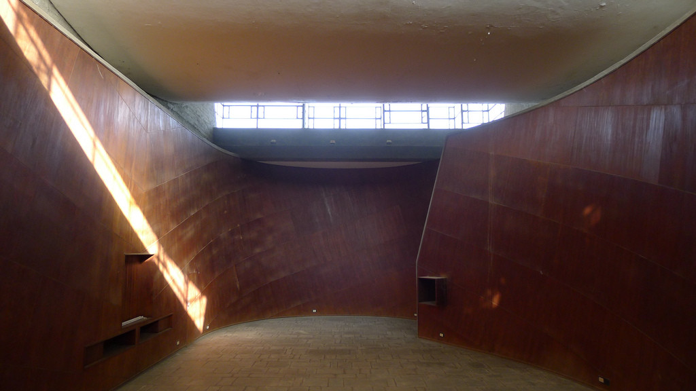

Palacio de Filateurs. Ahmedabad, India, 1951-1956
© panovscott

El diseño juega con la creación de múltiples microclimas, los interiores bajo los pilotis son zonas de refugio, frescos y a la sombra, donde se puede disfrutar de la brisa, y estar resguardado del sol intenso, mientras que las terrazas permiten la elección de espacios más soleados y cálidos, según la hora del día o la estación. En las mañanas o tardes más frescas de invierno, estos lugares soleados pueden ofrecer un ambiente cálido y agradable, ideal para pausas o reuniones informales al aire libre.

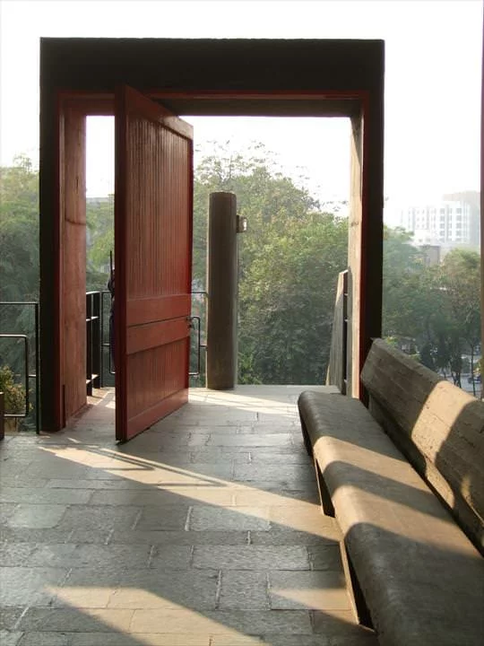

Palacio de Filateurs. Ahmedabad, India, 1951-1956
© FLC/ADAGP
 

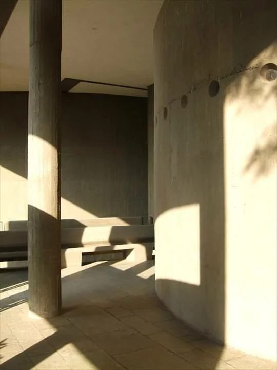   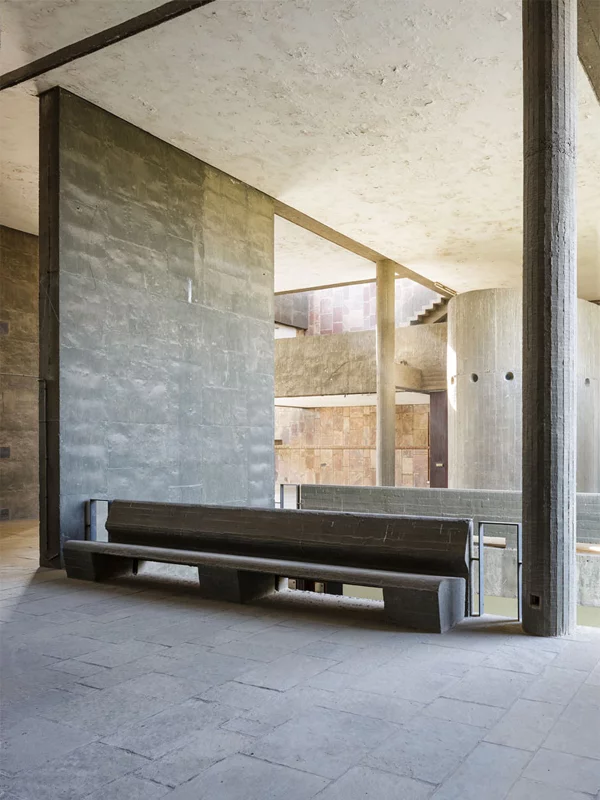

Palacio de Filateurs. Ahmedabad, India, 1951-1956
© FLC/ADAGP

## Centro de Control e Investigación de Productos Farmacéuticos (CQPA) en Amsterdam, Países Bajos de MVSA Architects, 2002

El diseño del Centro de Control e Investigación de Productos Farmacéuticos (CQPA) en Ámsterdam, de Meyer and Van Schooten Architecten (actualmente MVSA Architects), se basa en la creación de un ambiente interior adaptativo y dinámico que busca intencionalmente replicar los ligeros cambios de temperatura y corrientes de aire característicos de los climas naturales al aire libre. 

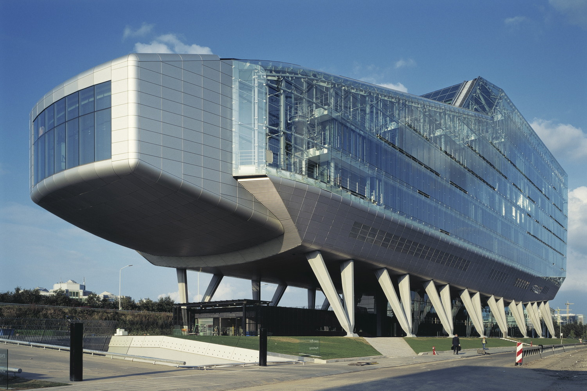

Sede principal de ING. Amsterdam, Países Bajos
Cortesía de MVSA Architects

Este principio de diseño se materializa a través de un sistema de ventilación híbrida y una fachada inteligente que responde a las condiciones externas. La cara orientada al sur recibe una intensa carga solar, mientras que la norte se enfrenta al ruido y la contaminación de la carretera. Para gestionar esto, se implementó una fachada de doble piel de vidrio que actúa como un amortiguador climático y acústico. (6.)

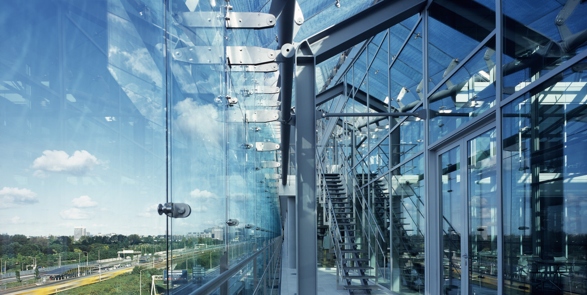

Sede principal de ING. Amsterdam, Países Bajos
Cortesía de MVSA Architects

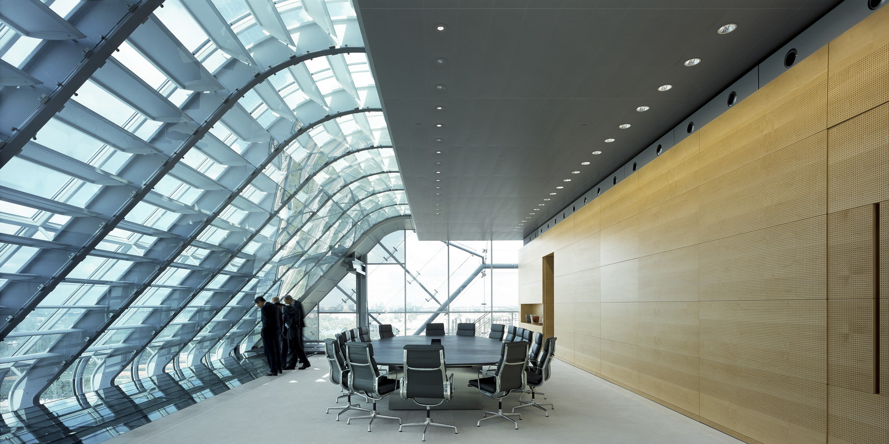

Sede principal de ING. Amsterdam, Países Bajos
Cortesía de MVSA Architects
 

El lado norte, permanece cerrado al exterior para aislar el ruido y la contaminación, y la brisa fresca se canaliza desde la parte sur, menos contaminada. 
En el lado sur, el calor de la camara de aire entre las dos capas de vidrio, asciende y se evacua por aberturas superiores, permitiendo que el aire fresco entre por abajo. Además, la doble piel esta asistida por toldos y persianas mecánicas en la cavidad, reduciendo la ganancia de calor solar. Este mecanismo permite a los ocupantes de las oficinas la libertad de abrir sus ventanas, experimentando una variabilidad ambiental controlada sin ser afectados por el ruido o corrientes fuertes.

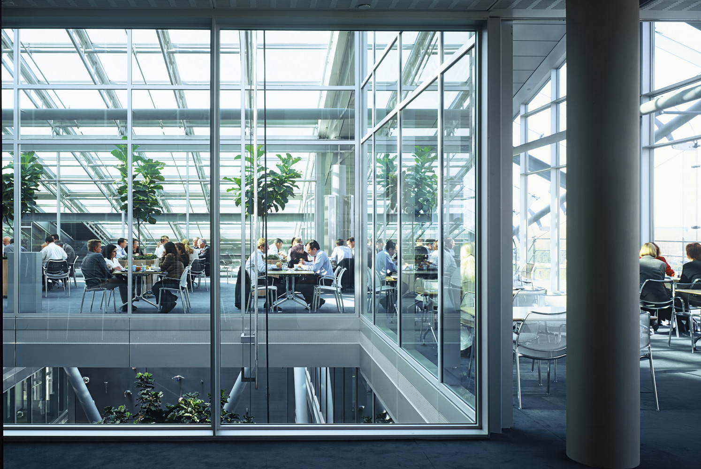

Sede principal de ING. Amsterdam, Países Bajos
Cortesía de MVSA Architects

Para el control climático fino, el edificio utiliza un techo climático metálico alimentado por un sistema de almacenamiento subterráneo de energía térmica (frío y calor), garantizando la estabilidad requerida, especialmente en las zonas críticas como laboratorios. 

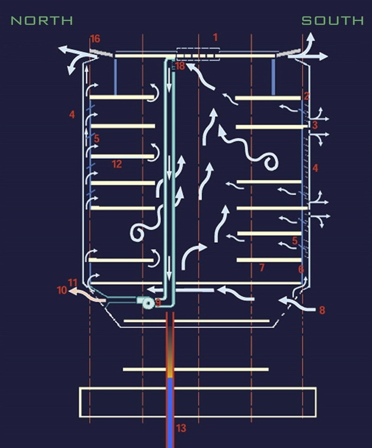

Sede principal de ING. Amsterdam, Países Bajos. Detalle 
Cortesía de MVSA Architects
 

1 _ Techo Climático

2 _ Protectores Solares Automáticos, a altura del suelo, para la reflexion de la luz natural de los espacios interiores

3 _ Válvulas Automáticas en la Capa Exterior

4 _ Fachada Simple

5 _ Ventanas Eléctricas y de Accionamiento Manual

6 _ Umbral Térmico, Vidrio Aislante

7 _ Fotocélulas para Reguladores de Iluminación

8 _ Aire Fresco

9 _ Recuperando Calor

10 _ Salida de Aire

11 _ Válvula de Cierre Automático

12 _ Unidad de Techo (Calefacción, Refrigeración, ventilación, Iluminación, Rociadores, Electricidad)

13 _ Acuífero

16 _ Válvulas automáticas

18 _ Conducto de retorno de aire, recuperación de calor

El edificio mejora su calidad espacial y climática mediante su diseño interior, que incluye una variedad de espacios abiertos, recortes y seis atrios temáticos y jardines interiores (como los de bambú, helechos, o palmeras) en diferentes plantas, que actúan como puntos de encuentro centrales y zonas de transición climática. 

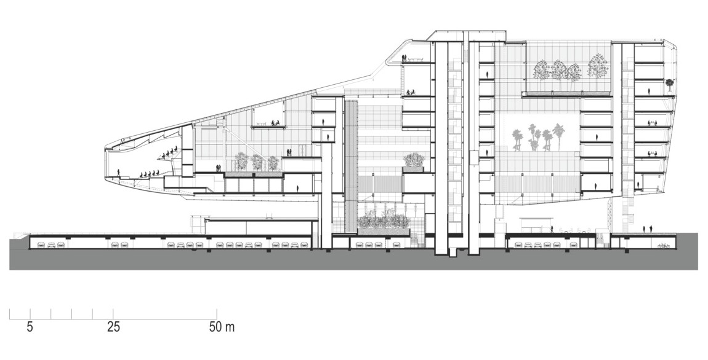

Sede principal de ING. Amsterdam, Países Bajos. Corte Longitudinal

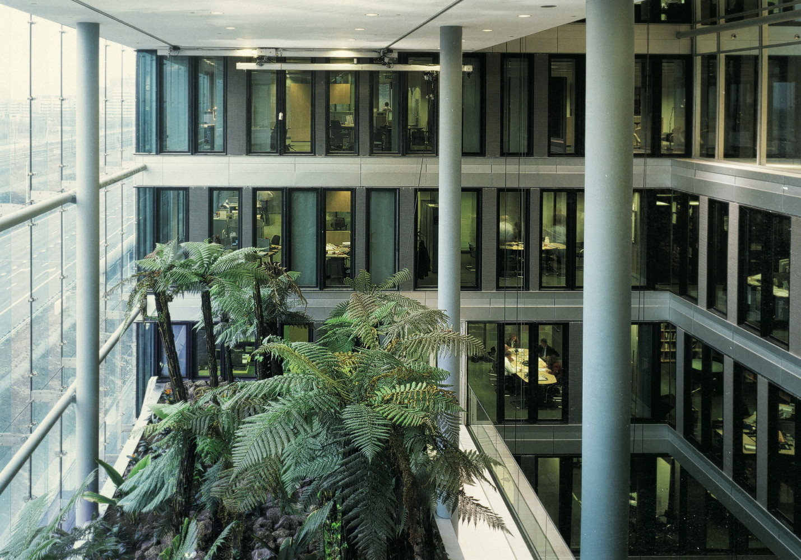

Sede principal de ING. Amsterdam, Países Bajos
Cortesía de MVSA Architects

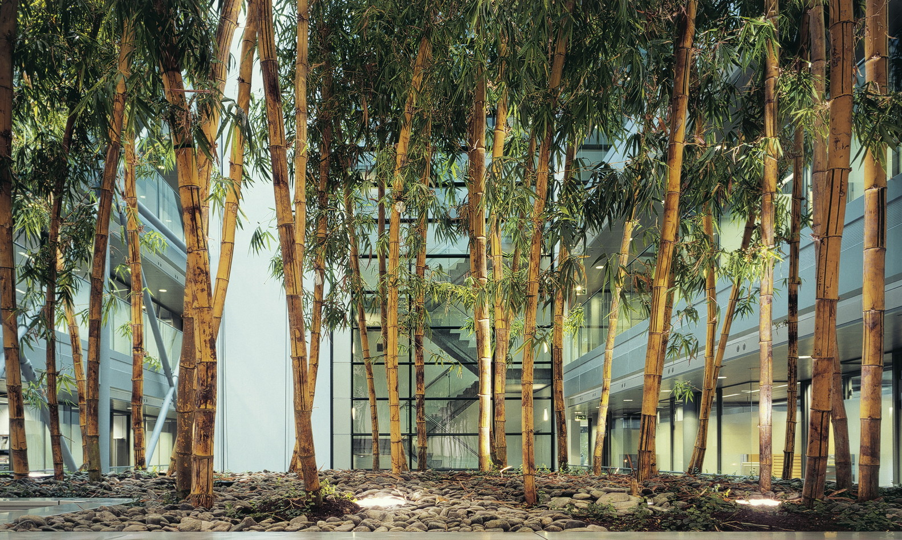

Sede principal de ING. Amsterdam, Países Bajos
Cortesía de MVSA Architects

Estos atrios introducen una variedad de paisajes y microclimas temáticos que rompen la monotonía, enriquecen visualmente el entorno de trabajo y, por su transparencia, probablemente facilitan la distribución del aire y la orientación de los usuarios, reforzando la sensación de estar en un ambiente más natural y estimulante.

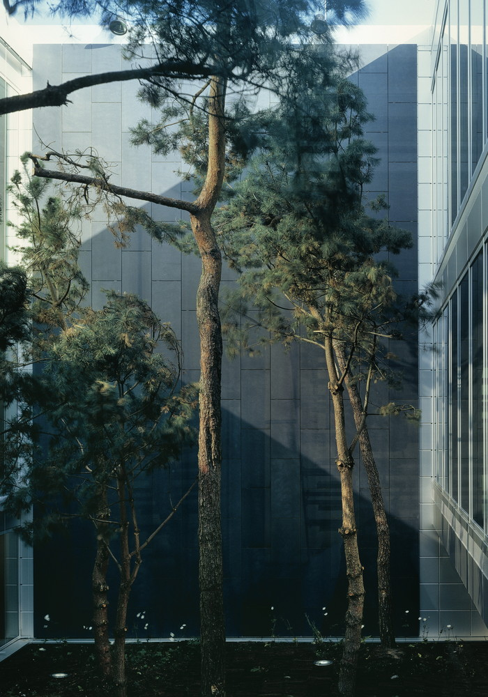

Sede principal de ING. Amsterdam, Países Bajos
Cortesía de MVSA Architects
 

### Referencias:

1. Browning, W.D., Ryan, C.O., Clancy, J.O. (2017). *14. Patterns of Biophilic Design [14 Patrones de diseño biofílico]* (Liana Penabad-Camacho, trad.) New York: Terrapin Bright Green, LLC (Trabajo original publicado en 2014).

2. Heschong, L. (1979). *Thermal Delight in Architecture.* Cambridge, MA: The MIT Press

3. Parkinson, T., & de Dear, R. (2016). *Thermal pleasure in built environments: spatial alliesthesia from air movement*. Building Research & Information. DOI: 10.1080/09613218.2016.1140932

4. Hadighi, M. (2025). *Le Corbusier’s Ahmedabad Millowners’ Association Building: Between the beautiful and the sublime.* Birkhäuser. 

5. Fondation Le Corbusier. *Palais des Filateurs. Ahmedabad, Inde, 1951-1956*

6. MVSA Architects. *ING House. 'Dustbuster', 'skate', an icon.*
