---
layout: post
title:  Presencia de Agua
date:   2026-03-24
image:  ../img/presencia-de-agua/7132_therme.jpg
tags:   Cities
--- 

La integración del agua en el espacio arquitectónico genera una experiencia que apela a la memoria biológica, transformando la percepción de un entorno estático en una atmósfera dinámica y multisensorial. Este patrón no se limita a la visualización directa de estanques o fuentes, sino que se manifiesta de forma multidimensional a través del sonido, el movimiento y la humedad ambiental. Su incorporación se fundamenta en la conexión biológica innata del ser humano con este recurso, la cual puede ser explicada desde una perspectiva evolutiva y psicológica, dado que el acceso al agua dulce era sinónimo de supervivencia.

 
Según las investigaciones de Gordon Orians y Judith Heerwagen sobre la hipótesis de la sabana (1.), nuestra especie retiene preferencias genéticas por características de los paisajes en los que evolucionaron nuestros ancestros, donde el agua era un recurso vital y escaso cuya presencia señalaba un hábitat de alta calidad para la supervivencia. Dado que la deshidratación representaba una amenaza constante, el acceso al agua resultaba esencial no solo para la hidratación y la higiene, sino también para la preparación de alimentos. Además, estos ecosistemas suelen albergar una biodiversidad mucho más rica que las zonas áridas. Por ello, esa escasez crítica durante las estaciones secas en la sabana africana moldeó nuestra percepción estética, convirtiendo al agua en un símbolo que mejora nuestra apreciación de los paisajes.

Orians sostiene que los estímulos que indican la disponibilidad de agua dulce evocan de manera casi instantánea respuestas emocionales positivas y un deseo de explorar el entorno, lo que explica por qué los jardines y parques diseñados para el disfrute humano suelen enfatizar este elemento a través de estanques o simulaciones de movimiento acuático. 

<blockquote style="margin-left: 30px;">
  <i>"Los humanos no somos animales adaptados al desierto. Nuestros antepasados ​​habrían necesitado beber a diario; la deshidratación probablemente era un riesgo constante. Sus áreas de distribución probablemente estaban determinadas por la distribución muy restringida de agua durante la estación seca y la ubicación de lugares seguros para dormir. Aunque el agua está presente en todos los entornos en los que los humanos pueden sobrevivir, la evidencia de la presencia de este recurso vital y escaso en las sabanas debería tener un atractivo especial para nosotros hoy."</i>
</blockquote>

Gordon H. Orians. Savanna Hypothesis. Pag. 2 (1.)

Esta fascinación ancestral es validada por los estudios de Thomas R. Herzog, quien realizó análisis cognitivos sobre las preferencias hacia diversos "paisajes de agua" o waterscapes (2.). Las preferencias humanas hacia los paisajes acuáticos se llevó a cabo mediante la presentación de setenta diapositivas a un grupo de más de doscientos participantes, de entornos naturales con agua, que incluían paisajes de montaña (con cascadas y arroyos rápidos), zonas pantanosas, ríos y lagos ordinarios, y grandes cuerpos de agua que se extendían hasta el horizonte (Fig 1.). El experimento se realizó pidiendo a los sujetos que calificaran las escenas en una escala numérica basada en criterios como el agrado personal (preferencia), la amplitud del espacio para deambular (espacialidad), la promesa de más información al avanzar (misterio), la coherencia visual, la familiaridad (identificabilidad), la cantidad de elementos (complejidad) y la textura.

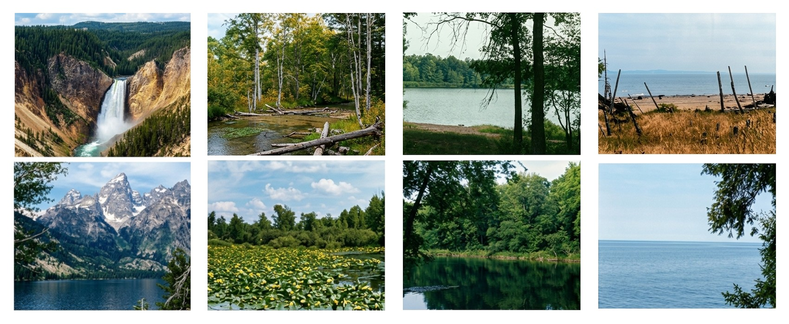

Figura 1. Imágenes a color tomadas de *A Cognitive Analysis of Preference for Waterscapes*. Pag. 232 (2.)

Primer columna: Paisajes Acuáticos de Montaña. 
Segunda columna: Zonas Pantanosas. 
Tercera columna: Ríos, Lagos y Estanques. 
Cuarta columna: Grandes Masas de Agua. 

A través de este método, Herzog demostró que las personas tienen una inclinación biológica y cognitiva muy marcada hacia ciertos tipos de paisajes, concluyendo que los entornos de montaña con aguas dinámicas y los grandes espejos de agua que ofrecen vistas despejadas son los que generan mayor placer y satisfacción. Por el contrario, su estudio evidenció un rechazo consistente hacia las aguas estancadas o pantanosas, demostrando que la percepción de frescura y la posibilidad de moverse con facilidad en el entorno son fundamentales para la preferencia estética. 

<blockquote style="margin-left: 30px;">
  <i>"Los paisajes acuáticos de montaña son fascinantes de observar, especialmente desde la distancia (la influencia positiva de la amplitud). Los mejores ejemplos son artísticos, en el sentido de que el agua y sus elementos circundantes forman un patrón bien organizado (la influencia positiva de la coherencia). Al mismo tiempo, la ocultación parcial atrae cognitivamente a la escena y también se valora (la influencia positiva del misterio)."</i>
</blockquote> 

Thomas R. Herzog. A Cognitive Analysis of Preference for Waterscapes. Pag. 238 (2.)

Según Herzog, los paisajes más valorados son aquellos que permiten "dar sentido" al entorno mediante la coherencia, pero que también fomentan la "implicación" del observador a través del misterio; es decir, mediante la promesa de descubrir nueva información al adentrarse en la escena. Bajo esta misma lógica, los escenarios de mayor preferencia son aquellas que no solo integran coherencia y misterio, sino que también ofrecen una gran amplitud. La espaciosidad destaca como un predictor positivo fundamental, confirmando que el ser humano valora profundamente la posibilidad de contemplar vistas amplias y sin obstáculos. Por el contrario, las texturas rugosas o los terrenos desiguales suelen ser predictores negativos, a excepción de los paisajes de montaña, donde la fascinación cognitiva compensa la dificultad del terreno para transitar. 

La interacción entre estas variables resulta determinante para predecir el potencial restaurador de un ambiente. Esto sugiere que tanto el contenido específico del paisaje como su configuración espacial influyen directamente en la respuesta emocional del individuo. En este sentido, los grandes cuerpos de agua generan una preferencia alta que Herzog atribuye a su extrema espaciosidad, sugiriendo que la vista de una superficie acuática vasta y ordenada puede evocar una sensación de asombro y facilitar un estado de tranquilidad que ayuda a descansar los mecanismos de atención.

<blockquote style="margin-left: 30px;">
  <i>"La vista del agua extendiéndose hasta el horizonte puede evocar una sensación de asombro ante la inmensidad, lo cual se refleja en las calificaciones de preferencia. Sin embargo, la inmensidad no es suficiente; es poco probable que las tierras baldías extensas y áridas sean muy apreciadas. Con su orden y texturas suaves, estas escenas bien podrían facilitar una sensación de tranquilidad que incita a la relajación y la meditación."</i>
</blockquote> 

Thomas R. Herzog. A Cognitive Analysis of Preference for Waterscapes. Pag. 239 (2.)

## Espacio azul: La importancia del agua para la preferencia, el afecto y la capacidad restauradora.

Un estudio mas reciente, realizado en 2010 por Mathew White y su equipo investiga la importancia de los entornos acuáticos o "espacios azules" en la percepción humana, destacando que su presencia aumenta significativamente la preferencia, el afecto positivo y la capacidad restauradora de los paisajes. (3.)

Para validar esta hipótesis se solicito a 40 participantes que evaluaran 120 fotografías que integraban nueve combinaciones de entornos acuáticos, verdes y construidos (Fig. 2) mediante preguntas, debajo de cada una de las imágenes, en cuatro ejes principales. En primer lugar, se midieron las preferencias estéticas ("¿Qué tan atractiva te parece esta escena?") y conductuales ("¿Qué tan dispuesto estarías a visitar esta escena?") calificando el atractivo de la escena y su disposición a visitarla en escalas del 1 (Nada) al 10 (Extremadamente). De igual manera, se evaluó la respuesta emocional ("¿Cómo te hace sentir esta foto?") a través de la valencia o afecto (de muy triste a muy feliz) y la activación (de tranquilo a emocionado). Finalmente, se analizó el perfil de los sujetos mediante su familiaridad con el entorno, indagando sobre el lugar donde crecieron, donde residen actualmente y su preferencia ideal de residencia, clasificando las respuestas en categorías de ambiente marino, verde o urbano.

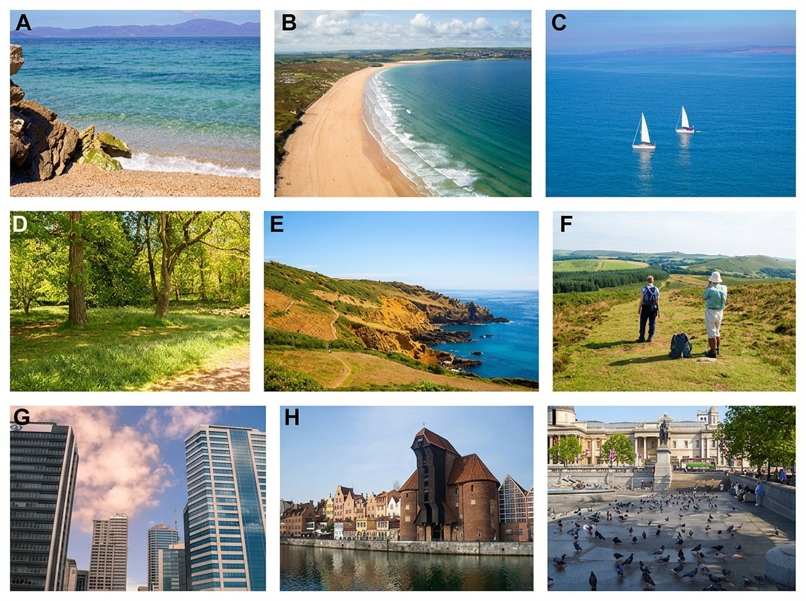

Figura 2. Imágenes a color tomadas de *Blue space: The importance of water for preference, affect, and restorativeness ratings of natural and built scenes.* Pag. 485 (3.)

Escenas de ejemplo: A) Solo acuático; B) Acuático-Verde; C) Solo acuático + Objeto; D) Solo verde; E) Verde-Acuático; F) Solo verde + Personas; G) Solo construido; H) Construido-Acuático; I) Construido-Verde + Animales.

Los resultados obtenidos demostraron que tanto las escenas naturales como las construidas que incluyen agua son valoradas de forma más positiva que aquellas que carecen de ella. Las calificaciones de preferencia para los 9 entornos, ordenadas de menor a mayor, se presentan en la figura 3. Un hallazgo clave es que los entornos urbanos que integran elementos acuáticos fueron calificados tan positivamente como los espacios naturales puramente verdes, lo que sugiere que el agua puede mitigar la percepción negativa de los entornos construidos, otorgando al diseño arquitectónico una herramienta poderosa para reducir el estrés urbano.

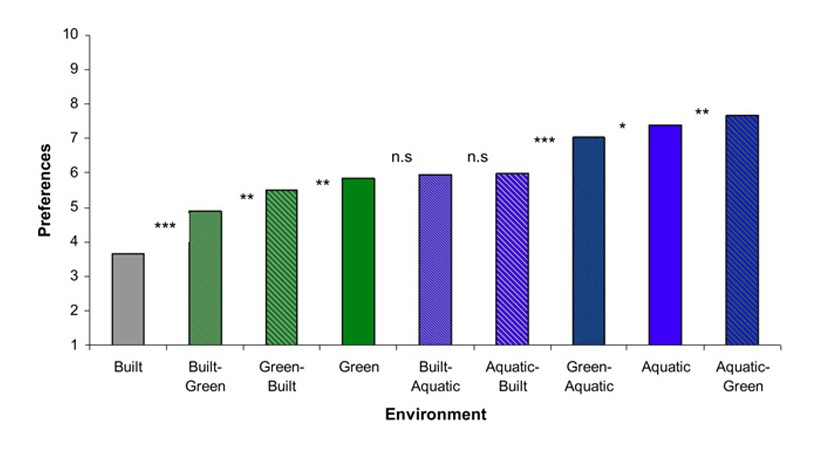

Figura 3. Entornos clasificados de menos a más preferidos. Tomado de *Blue space: The importance of water for preference, affect, and restorativeness ratings of natural and built scenes.* Pag. 487 (3.)

El análisis también reveló que el atractivo de los espacios naturales aumenta conforme se incrementa la proporción de agua visible, aunque las escenas que combinan grandes masas de agua con elementos de vegetación, como el borde costero, suelen preferirse sobre las que contienen exclusivamente agua. En entornos urbanos, el beneficio se manifiesta con la sola presencia del agua, independientemente de si su proporción aumenta, bastando con la integración de fuentes, estanques o el acceso a costas para promover el bienestar mental de los ciudadanos.

En conjunto, estos autores coinciden en que el agua no solo cumple una función fisiológica, sino que actúa como un disparador de placer sensorial y calma mental, facilitando una recuperación más rápida ante el estrés y mejorando la capacidad de concentración al ofrecer estímulos restauradores que permiten descansar los procesos cognitivos fatigados.

# La teoría aplicada al espacio

## Termas de Vals en Grisones, Suiza, de Peter Zumthor

Las Termas de Vals, diseñadas por Peter Zumthor y finalizadas en 1996, como parte de un complejo hotelero en el cantón de los Grisones, representan una de las manifestaciones más puras del diseño sensorial donde el agua no es simplemente un elemento funcional, sino el eje que dicta la experiencia espacial completa. 

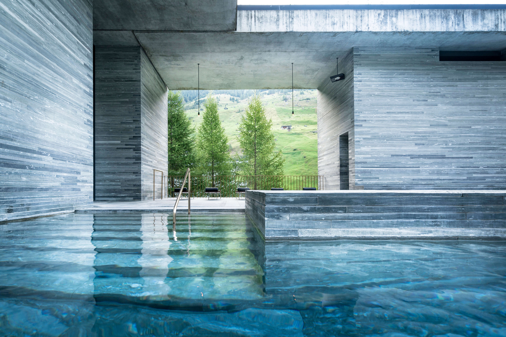

© 7132 Therme / Hotel.

El edificio se funde con la topografía y la geología del lugar, al estar parcialmente enterrado y cubierto por un techo de pasto silvestre que lo integra con la montaña, la obra establece una conexión visceral con su origen natural. Esta estructura, que parece emerger del suelo como un afloramiento geológico, define su identidad a través del uso de materiales locales como la piedra gneis gris azulado (similar al granito) extraída de las montañas cercanas y el agua de los manantiales termales del sitio.

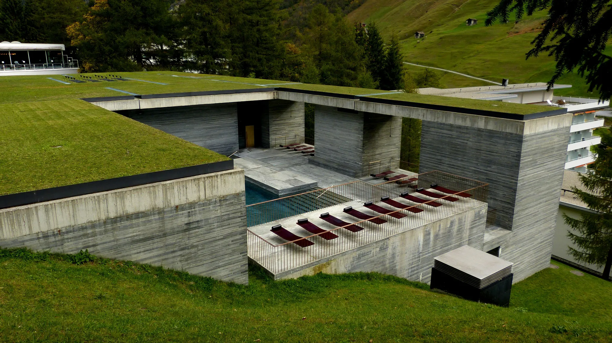

© Kazunori Fujimoto.

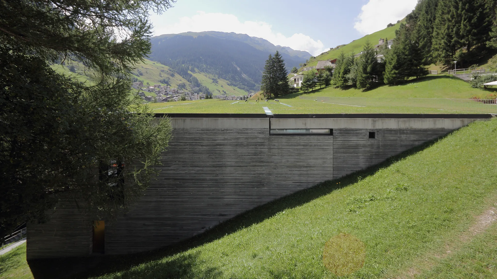

© Kazunori Fujimoto.

La obra subvierte la noción de arquitectura meramente visual para proponer un enfoque multisensorial donde el agua no es solo un servicio atrapado en la red de tuberías, sino un material de construcción integral que se revela a los visitantes a través del tiempo y el espacio. El recorrido se articula como una exploración por una caverna mística tallada en la montaña, a medida que se avanza, el cuerpo se sumerge en una atmósfera de penumbra y humedad, descubriendo volúmenes que actúan como cámaras de resonancia sensorial. En estos espacios, el agua deja de ser estática para transformarse en sonido, temperatura, aroma o sabor, convirtiendo el tránsito por el edificio en un ritual de descubrimiento táctil y auditivo que disuelve la frontera entre la estructura sólida y la fluidez del manantial.

  

    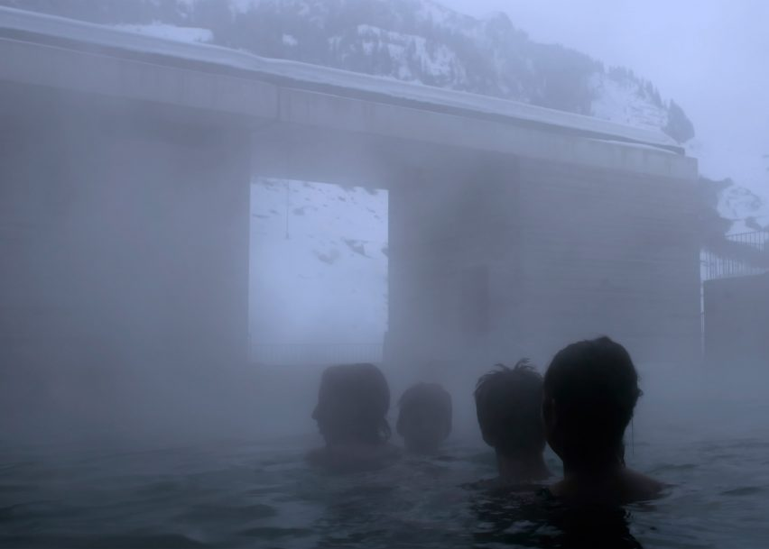
    

    © Fernando Guerra.
    

  

  

    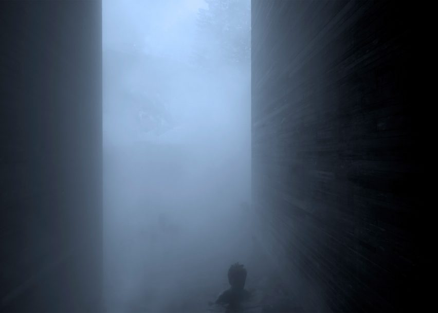
    

    © Fernando Guerra.
    

  

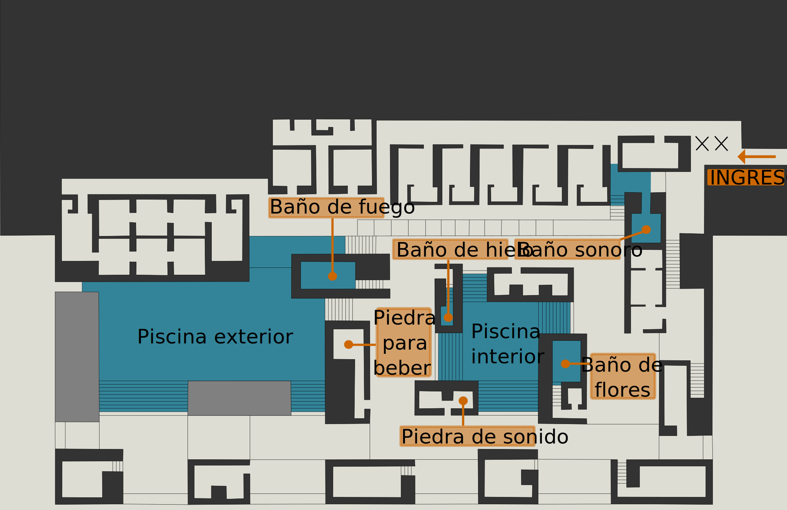

Planta. Elaboración personal a partir de Micha L. Rieser at de.wikipedia, Public domain, via Wikimedia Commons.

La presencia de agua en las termas es cautivadora y fluye a través de una serie de espacios orquestados que incluyen piscinas de diferentes temperaturas. Al transitar entre las distintas cámaras como el baño de fuego a 42°C y el de hielo a 12°C, el cuerpo experimenta aliestesia o placer térmico, percibiendo el entorno mediante el contacto directo con la piel, el vapor que humecta el aire y las constantes variaciones térmicas. En cada espacio, el arquitecto diseña una conexión particular entre el usuario y el agua, permitiendo que el cuerpo explore diversas texturas y grados de calor. Por ejemplo, el baño de fuego evoca la calidez extrema mediante el dominio del color rojo, mientras que en el baño de hielo, el agua se enmarca en muros de piedra donde predominan los tonos azules y grises. Incluso la experiencia táctil se eleva en el baño de flores, donde la superficie del agua está cubierta con pétalos que flotan, generando un aroma intenso y una sensación única al tacto.

  

    
    

    © Fernando Guerra.
    

  

  

    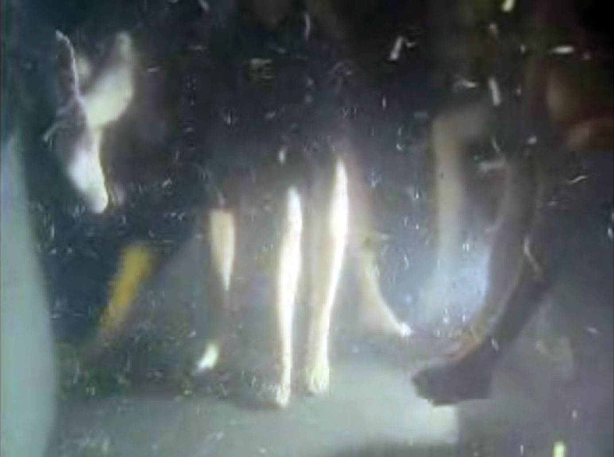
    

    Baño de las Flores. © Richard Copans‘ Les Thermes de Pierre film (4.)
    

  

  

    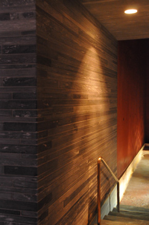
    

    Baño de Fuego. © Styliane Philippou
    

  

  

    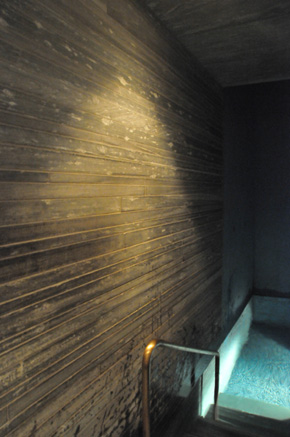
    

    Baño de Hielo. © Styliane Philippou
    

  

Zumthor fomenta la interacción directa al canalizar el agua de manantial de diversas formas. En el "Trinkstein" (piedra de beber), los visitantes pueden degustar el agua tibia y sin filtrar directamente de la fuente o sobre la pared del pasillo, donde el agua rica en sulfato de calcio y bicarbonato, fluye sobre placas de latón para ser catada. Así, el sentido del gusto se integra plenamente en la conexión con la naturaleza.

  

    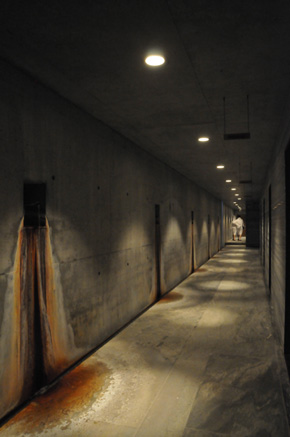
    

    © Styliane Philippou.
    

  

  

    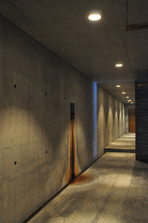
    

    © Styliane Philippou.
    

  

La experiencia auditiva cobra vida con el goteo de los grifos de bronce y se intensifica al llegar al Klangbad o baño sonoro, donde la acústica y el agua crean una atmósfera mística y envolvente. Se ingresa a esta cámara de 6 metros de altura nadando a través de una angosta abertura en el agua a 35°C. A diferencia del resto del edificio, las paredes aquí conservan un corte natural e irregular, una textura rugosa diseñada para que el sonido rebote de eco en eco. Esta arquitectura convierte el espacio en una cámara de resonancia donde los rumores del agua y las voces se elevan y se pierden en la altura, envolviendo al visitante en un aura de misticismo absoluto. (5.)

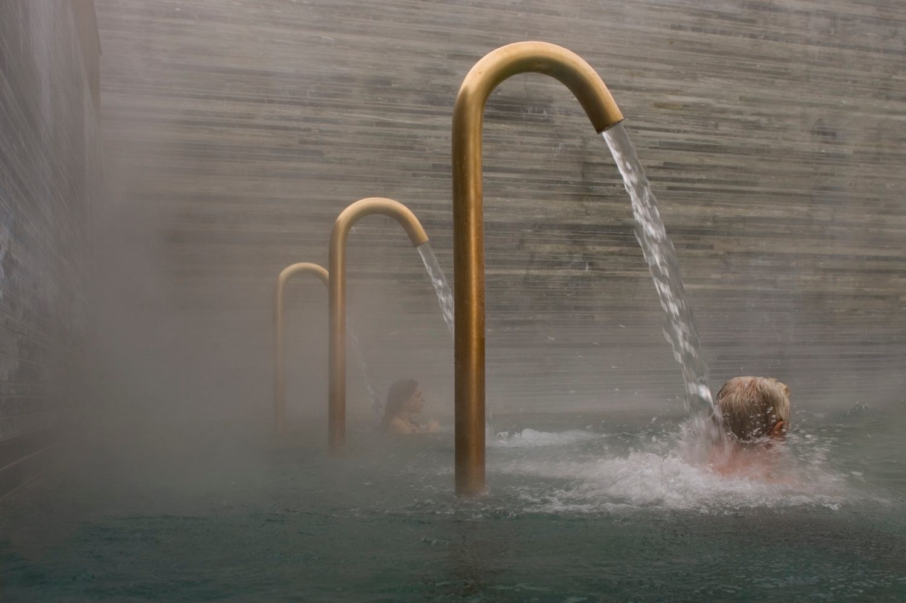

© Fernando Guerra.

<iframe src="https://www.facebook.com/plugins/video.php?height=476&href=https%3A%2F%2Fwww.facebook.com%2Freel%2F2132809720792240%2F&show_text=false&width=267&t=0" width="267" height="476" style="border:none;overflow:hidden" scrolling="no" frameborder="0" allowfullscreen="true" allow="autoplay; clipboard-write; encrypted-media; picture-in-picture; web-share" allowFullScreen="true"></iframe>

Visualmente, la superficie acuática interactúa con la luz natural que penetra a través de estrechas aberturas en el techo, haciendo que la piedra se ilumine y el agua brille, creando reflejos temporales e inesperados sobre las superficies de piedra. El agua aquí no es estática; es un elemento vivo que define el ritmo del recorrido, obligando al usuario a sumergirse en una penumbra que evoca la seguridad de una cueva ancestral. La materialidad de la roca, con sus capas horizontales que imitan el sedimento geológico, se ve constantemente activada por el contacto con el agua, que altera su color y textura, revelando una belleza efímera y cambiante que satisface nuestra necesidad de variabilidad sensorial. Al enfatizar las cualidades del agua, Zumthor logra que el edificio deje de ser un objeto para convertirse en un organismo, donde el flujo constante del manantial termal nutre una experiencia de introspección y bienestar profundo.

<blockquote style="margin-left: 30px;">
  <i>"Desde el principio, sentí la naturaleza mística de un mundo de piedra dentro de la montaña, la oscuridad y la luz, el reflejo de la luz sobre el agua, la difusión de la luz a través del aire vaporizado, los diferentes sonidos que el agua produce en entornos de piedra, la calidez de la piedra y la piel desnuda, el ritual del baño. El placer de trabajar con estos objetos, de usarlos conscientemente, estuvo presente desde el principio."</i>
</blockquote>

Peter Zumthor. Peter Zumthor Works. Pag. 156 (6.)

  

    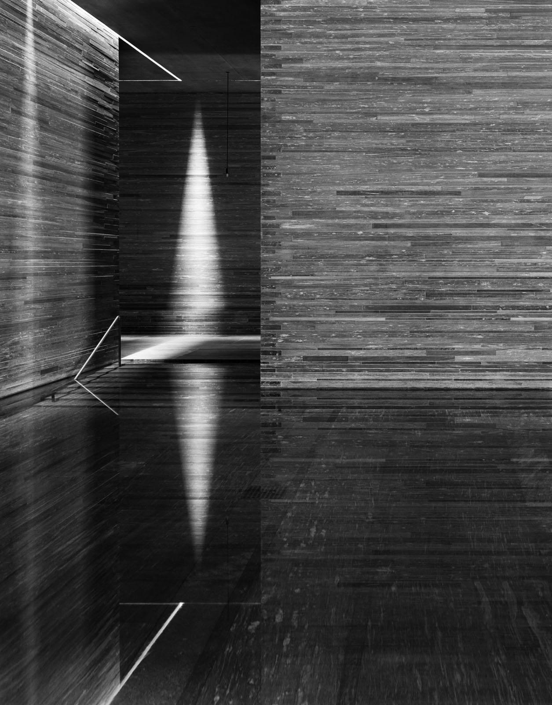
    

    © Hélène Binet.
    

  

  

    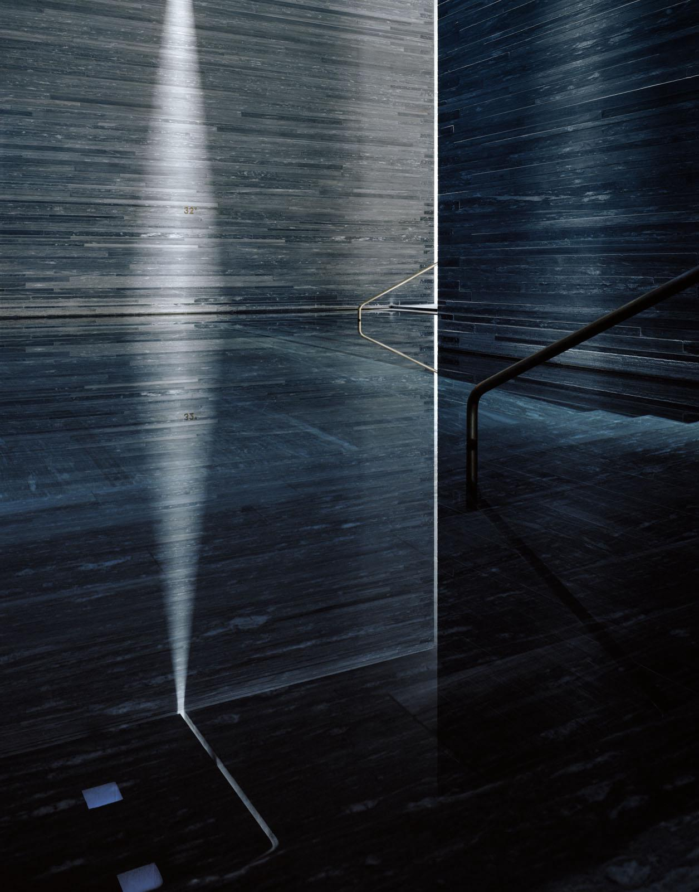
    

    © Hélène Binet.
    

  

Bajo los principios del diseño biofílico, estas experiencias multisensoriales resultan más efectivas que las puramente visuales. En las Termas de Vals, el movimiento de las ondas, el reflejo de la luz sobre la superficie líquida y su proximidad física, no solo capturan nuestra atención de forma espontanea, sin agotar nuestras reservas de energía mental, si no que también facilitan una restauración cognitiva completa que fortalece el vínculo afectivo por el lugar. Esto valida la premisa de que nuestra psique responde positivamente a los elementos naturales, reduciendo el estrés, disminuyendo el ritmo cardíaco y promoviendo una profunda tranquilidad. En este sentido, la obra de Zumthor se manifiesta como una gran masa de piedra tallada que contiene el agua, estableciendo una relación armoniosa entre ambos materiales. Esta configuración permite al ser humano reconectarse con su esencia biológica, recordándonos nuestra afinidad evolutiva con el movimiento de los fluidos naturales y el impacto profundo que estos tienen en nuestra percepción del espacio.

<iframe width="560" height="315" src="https://www.youtube.com/embed/oOaPRkdVyJk?si=jBVDqR_eTIDGv2PV" title="YouTube video player" frameborder="0" allow="accelerometer; autoplay; clipboard-write; encrypted-media; gyroscope; picture-in-picture; web-share" referrerpolicy="strict-origin-when-cross-origin" allowfullscreen></iframe>

<blockquote style="margin-left: 30px;">
  <i>"Así pues, nuestro baño no es un escaparate de los últimos artilugios acuáticos, chorros, boquillas o toboganes. Se basa, en cambio, en las experiencias silenciosas y primarias del baño, la limpieza y la relajación en el agua; en el contacto del cuerpo con el agua a diferentes temperaturas y en distintos tipos de espacios; al tocar la piedra. Un espacio interior continuo, como un sistema geométrico de cuevas, serpentea a través de la estructura del baño, compuesta por grandes bloques de piedra, creciendo en tamaño a medida que se aleja de las estrechas cavernas junto a la montaña hacia la luz natural en la fachada. En el borde frontal del edificio se produce un cambio de percepción. El mundo exterior penetra a través de grandes aberturas y se funde con el sistema de cavernas excavadas. El edificio en su conjunto se asemeja a una gran piedra porosa. En los puntos donde esta "gran piedra" sobresale de la pendiente, la estructura de la caverna, cortada con precisión, se convierte en fachada."</i>
</blockquote>

Peter Zumthor. Peter Zumthor Works. Pag. 156 (6.)

<iframe width="560" height="315" src="https://www.youtube.com/embed/zvCWr84HISI?si=sCWZDaQX86Mq3nzb&amp;start=2" title="YouTube video player" frameborder="0" allow="accelerometer; autoplay; clipboard-write; encrypted-media; gyroscope; picture-in-picture; web-share" referrerpolicy="strict-origin-when-cross-origin" allowfullscreen></iframe>

Referencias:

1. Gordon H. Orians. (2016). Savanna Hypothesis. University of Washington, Seattle, WA, USA. Springer International Publishing Switzerland 2016. T.K. Shackelford, V.A. Weekes-Shackelford (eds.), Encyclopedia of Evolutionary Psychological Science, DOI 10.1007/978-3-319-16999-6_2930-1
2. Herzog, T. R. (1985). A cognitive analysis of preference for waterscapes. Journal of Environmental Psychology, 5, 225-241. 
3. White, M., Smith, A., Humphryes, K., Pahl, S., Snelling, D., & Depledge, M. (2010). Blue space: The importance of water for preference, affect, and restorativeness ratings of natural and built scenes. Journal of Environmental Psychology, 30(4), 482-493. 
4. Captura de Pantalla de Richard Copans‘ Les Thermes de Pierre film, Arte France and Centre Pompidou, (2000). Extraida de Bziotas, E. (2010). Therme Baths at Vals, Switzerland: Peter Zumthor.
5. Hauser, S. y Zumthor, P. (2007). Therme Vals. Fotografías de Hélène Binet. Zurich: Scheidegger & Spiess 
6. Zumthor, P. (1998). Peter Zumthor Works: Buildings and Projects 1979-1997. Fotografías de Hélène Binet. Basilea: Birkhäuser.